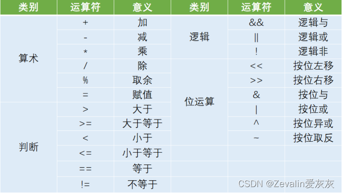

## Keil 常见数据类型

## Keil的数据运算

## sfr,sbit
（1）sfr（special function register）：特殊功能寄存器声明
```
例：sfr P0 = 0x80;  //声明P0寄存器，物理地址为0x80
```
（2）sbit（special bit）：特殊位声明（使用频率较高）
```
例：sbit P0_1 = 0x81;    //或  sbit P0_1 = P0^1;  声明P0寄存器的第1位
```
## 可位寻址/不可位寻址
在单片机系统中，操作任意寄存器或者某一位的数据时，必须给出其物理地址，又因为一个寄存器里有8位，所以位的数量是寄存器数量的8倍，单片机无法对所有位进行编码，故每8个寄存器中，只有一个是可以位寻址的。对不可位寻址的寄存器，若要只操作其中一位而不影响其它位时，可用“&=”、“|=”、“^=”的方法进行位操作。
```
|=（或赋值）：用于 “置位” 某一位（设为 1）。
例：reg |= (1 << 2)
意思是：用1<<2生成一个 “第 2 位为 1、其他位为 0” 的掩码，通过 “或运算” 让寄存器的第 2 位强制为 1，其他位不变（因为 0 或任何数还是原数）。
```
```
&=（与赋值）：用于 “清零” 某一位（设为 0）。
例：reg &= ~(1 << 2)
意思是：~(1<<2)生成 “第 2 位为 0、其他位为 1” 的掩码，通过 “与运算” 让寄存器的第 2 位强制为 0，其他位不变（因为 1 与任何数还是原数）。
```
```
^=（异或赋值）：用于 “翻转” 某一位（0 变 1，1 变 0）。
例：reg ^= (1 << 2)
意思是：用掩码让第 2 位与 1 异或（0^1=1，1^1=0），其他位与 0 异或（不变），实现翻转。
```

# LED
## 开发板中的LED模块
### 1.电路图分析

ED正极接电源VCC（VCC提供正向5V电压）；红框内的是限流电阻，如果不加限流电阻，那么流过LED的电流会很大，可能会对LED造成破坏；LED负极对接MCU的引脚（引脚输出的电平由P2寄存器控制，图中的P20-P27其实是P2的8位分别控制0-7这8个引脚），如果引脚输出高电平，LED不会被点亮，如果引脚输出低电平，LED才会有正向电流，从而会被点亮。
### 2. 通过写代码点亮LED的原理

程序通过CPU给寄存器进行配置，寄存器通过驱动器向外部引脚输出高电平or低电平
## 点灯
### 1.点亮一个LED灯
```c

#include <REGX52.H>  //头文件
 
void main()
{
	
	P2 = 0xFE;  //给P2寄存器配置成1111 1110从而控制只有1个LED被点亮
	
	while(1)
	{
		//可以写一个死循环让这段代码一直执行
		//没有死循环的话，其实void main()包含的代码也是一直重复执行
	}
}
```
### 2.8个LED灯轮流闪烁（流水灯）
```

#include <REGX52.H>
#include <INTRINS.H>  //_nop_()需要这个头文件
 
void Delay500ms()	//借助STC-ISP生成的500ms延时函数（开发板不同，这个函数也会不同！）
{
	unsigned char i, j, k;
 
	_nop_();
	i = 4;
	j = 129;
	k = 119;
	do
	{
		do
		{
			while (--k);
		} while (--j);
	} while (--i);
}
 
void main()
{
	while(1)
	{
		P2 = 0xFE; //1111 1110，第一盏LED灯被点亮
		Delay500ms();
		P2 = 0xFD; //1111 1101，第二盏LED灯被点亮
		Delay500ms();
		P2 = 0xFB; //1111 1011，第三盏LED灯被点亮
		Delay500ms();
		P2 = 0xF7; //1111 0111，第四盏LED灯被点亮
		Delay500ms();
		P2 = 0xEF; //1110 1111，第五盏LED灯被点亮
		Delay500ms();
		P2 = 0xDF; //1101 1111，第六盏LED灯被点亮
		Delay500ms();
		P2 = 0xBF; //1011 1111，第七盏LED灯被点亮
		Delay500ms();
		P2 = 0x7F; //0111 1111，第八盏LED灯被点亮
		Delay500ms();
	}
	
}
```
```
#include <REGX52.H>
#include <INTRINS.H>  //_nop_()需要这个头文件
 
void Delay1ms(unsigned int xms)		//对借助STC-ISP生成的1ms延时函数进行修改
{
	while(xms)  //让这个1ms延时函数重复执行xms次
	{
		unsigned char i, j;
 
	_nop_();
	i = 2;
	j = 199;
	do
	{
		while (--j);
	} while (--i);
	xms--;  //smx作为计数器
	}
}
 
void main()
{
	P2 = 0xFE;  //1111 1110，初始状态为第一个LED灯亮
	while(1)
	{
		if(P2 == 0xFF)  //一轮循环结束，重置为初始状态（第一个LED灯亮）
			P2 = 0xFE;
		Delay1ms(500);  //500ms延时（根据需求可以传入不同的延时时间）
		P2 = P2 << 1;  //下一个LED灯亮（P2中的0左移）
		P2 += 1;  //第一轮循环结束前亮过的LED灯不能再亮（左移会导致第一位为0，需要将其修改为1）
		
	}
}
```