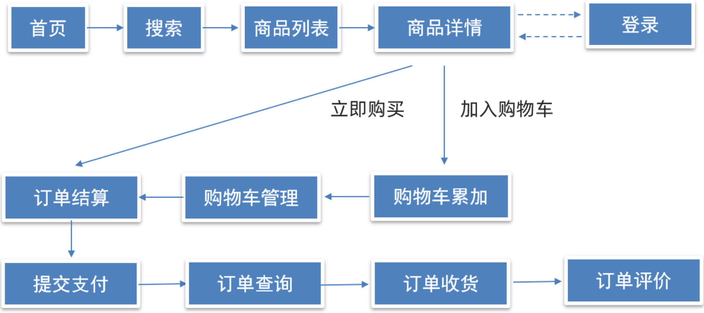

# **1. 项目概述（Project Overview）**

**目标**：开发一个基于 Web 的购物车前端，实现商品浏览、添加购物车、修改购物车、结算等功能。  
**适用场景**：B2C 电商网站、在线零售平台。  
**用户角色**：

-   **普通用户**：浏览商品、添加购物车、修改购物车、结算订单。
-   **管理员（可选）** ：管理商品信息。

* * *

# **2. 需求分析（Requirements Analysis）**

### 一、功能需求分析

#### 1. 商品浏览与搜索

-   **首页**：作为入口，展示热门商品、分类导航等，引导用户操作。
-   **搜索**：支持关键词搜索商品，快速定位目标商品，提升购物效率。
-   **商品列表**：展示搜索结果或分类商品，包含商品基础信息（如名称、价格、图片），支持筛选、排序。
-   **商品详情**：展示商品完整信息（规格、详情介绍、用户评价等），提供 “加入购物车” 和 “立即购买” 按钮。

#### 2. 用户登录

-   访问商品详情页的 “加入购物车”“立即购买” 功能时，校验用户登录状态；未登录用户跳转登录页，支持账号密码、第三方授权等登录方式。

#### 3. 购物车功能

-   **加入购物车**：将商品添加至购物车，记录商品规格、数量、价格等信息，支持购物车累加（同一商品多次添加时数量叠加）。
-   **购物车管理**：允许用户修改商品数量、删除商品、勾选结算商品，支持批量操作。
-   **订单结算**：从购物车选择商品进入结算页，展示收货地址、支付方式、订单金额（含优惠计算）等信息。

#### 4. 订单流程

-   **提交支付**：生成订单并跳转支付页面，支持多种支付方式（如微信、支付宝），支付成功后更新订单状态。
-   **订单查询**：用户可查看订单详情、物流状态、支付状态等信息。
-   **订单收货**：用户确认收货后，订单状态更新为 “已收货”。
-   **订单评价**：收货后允许用户对商品进行评价（文字、评分、图片上传），评价内容展示在商品详情页。

### 二、用户角色分析

-   **普通用户**：浏览商品、搜索商品、登录、管理购物车、下单支付、查询订单、评价商品。


### 三、业务规则分析

-   **登录限制**：涉及交易的操作（加入购物车、立即购买、结算等）需用户登录，保障交易安全性。
-   **库存校验**：加入购物车或立即购买时，检查商品库存，库存不足需提示用户。
-   **价格规则**：结算时计算商品总价，支持优惠券、满减等优惠活动的金额抵扣。
-   **订单状态流转**：按 “已下单→待支付→已支付→待收货→已收货→已评价” 状态流转，每个状态对应不同操作权限。

### 四、非功能需求分析

-   **性能需求**：页面加载速度快，购物车、订单等操作响应及时，支持高并发访问（如促销活动期间）。
-   **安全性需求**：用户登录信息加密传输，支付流程遵循安全规范，防止订单数据篡改。
-   **兼容性需求**：支持主流浏览器（Chrome、Firefox、Edge 等）及移动端设备访问。
-   **用户体验**：界面交互友好，操作流程简洁（如一键登录、购物车编辑实时反馈），错误提示清晰（如库存不足、输入格式错误）。

* * *

# **3. 技术选型（Tech Stack）**

| **技术**    | **选型**                      | **说明**      |
| --------- | --------------------------- | ----------- |
| **前端框架**  | Vue3 + Vite                | 快速构建现代前端应用  |
| **状态管理**  | Pinia | 管理购物车数据     |
| **UI 框架** |  ElementPlus    | 提供美观的 UI 组件 |
| **数据请求**  | Axios           | 获取商品数据      |
| **路由管理**  | Vue Router 4               | 页面跳转        |
| **本地存储**  | pinia-plugin-persistedstate    | 存储购物车数据     |
| **支付集成**  | Stripe / 微信支付 / 支付宝         | 订单支付（可选）    |

* * *

# **4. 体系架构（Architecture Design）**

前端采用**组件化架构**，划分为以下模块：

```plaintext
📦 src  
┣ 📂 assets  
┃   // 静态资源，如图片、样式文件等  
┣ 📂 components  
┃   // 组件目录，按通用性拆分  
┃   ┣ 📂 common  
┃   ┃   // 通用组件（可全局复用，不依赖特定业务场景）  
┃   ┃   ┗ 📜 CountBox.vue  
┃   ┃       // 数量选择组件，如商品数量增减框  
┃   ┗ 📂 business  
┃       // 业务组件（与特定页面逻辑强相关）  
┃       ┣ 📜 GoodsItem.vue  
┃       ┃   // 商品列表项组件，展示商品基本信息  
┃       ┗ 📜 OrderListItem.vue  
┃           // 订单列表项组件，展示订单详情信息  
┣ 📂 pages  
┃   // 页面组件目录，存放不同业务页面  
┃   ┣ 📂 layout  
┃   ┃   // 布局相关页面  
┃   ┃   ┣ 📜 LayoutContainer.vue  
┃   ┃   ┃   // 通用布局容器组件，包裹页面公共结构  
┃   ┃   ┣ 📜 Home.vue  
┃   ┃   ┃   // 首页组件，展示系统入口内容  
┃   ┃   ┣ 📜 Cart.vue  
┃   ┃   ┃   // 购物车页面组件，管理购物车商品  
┃   ┃   ┣ 📜 User.vue  
┃   ┃   ┃   // 用户中心页面组件，用户信息管理  
┃   ┃   ┗ 📜 Category.vue  
┃   ┃       // 商品分类页面组件，展示商品分类  
┃   ┣ 📂 login  
┃   ┃   // 登录相关页面  
┃   ┃   ┗ 📜 LoginPage.vue  
┃   ┃       // 登录页面组件，处理用户登录操作  
┃   ┣ 📂 myorder  
┃   ┃   // 我的订单相关页面  
┃   ┃   ┗ 📜 MyorderPage.vue  
┃   ┃       // 我的订单页面组件，展示用户订单列表  
┃   ┣ 📂 pay  
┃   ┃   // 支付相关页面  
┃   ┃   ┗ 📜 PayPage.vue  
┃   ┃       // 支付页面组件，处理支付流程  
┃   ┣ 📂 prodetail  
┃   ┃   // 商品详情相关页面  
┃   ┃   ┗ 📜 ProdetailPage.vue  
┃   ┃       // 商品详情页面组件，展示商品详细信息  
┃   ┗ 📂 search  
┃       // 搜索相关页面  
┃       ┣ 📜 Itemlist.vue  
┃       ┃   // 搜索结果列表组件，展示搜索到的商品  
┃       ┗ 📜 SearchPage.vue  
┃           // 搜索页面组件，提供搜索输入和结果展示  
┣ 📂 router  
┃   // 路由配置目录  
┃   ┗ 📜 index.js  
┃       // 路由主配置文件，定义页面路由规则  
┣ 📂 stores  
┃   // 状态管理目录（基于 Pinia）  
┃   ┣ 📂 modules  
┃   ┃   // 状态模块  
┃   ┃   ┣ 📜 cart.js  
┃   ┃   ┃   // 购物车状态模块，管理购物车相关数据  
┃   ┃   ┗ 📜 user.js  
┃   ┃       // 用户状态模块  
┃   ┗ 📜 index.js  
┃       // Pinia 实例创建文件，初始化状态管理  
┣ 📂 services  
┃   // 服务接口目录，封装 API 请求  
┃   ┣ 📜 category.js  
┃   ┃   // 商品分类相关接口，如获取分类列表  
┃   ┣ 📜 cart.js  
┃   ┃   // 购物车相关接口，如添加商品到购物车  
┃   ┣ 📜 home.js  
┃   ┃   // 首页相关接口，如获取首页推荐商品  
┃   ┣ 📜 login.js  
┃   ┃   // 登录相关接口，处理登录验证逻辑  
┃   ┣ 📜 order.js  
┃   ┃   // 订单相关接口，如创建订单、查询订单  
┃   ┣ 📜 product.js  
┃   ┃   // 商品相关接口，如获取商品详情  
┃   ┣ 📜 user.js  
┃   ┃   // 用户相关接口，如获取用户信息  
┃   ┗ 📜 address.js  
┃       // 地址相关接口，管理用户收货地址  
┣ 📂 utils  
┃   // 工具函数目录  
┃   ┗ 📜 request.js  
┃       // 网络请求封装工具，统一处理 API 调用逻辑  
┣ 📜 App.vue  
┃   // 主应用入口组件  
┗ 📜 main.js  
    // 项目渲染入口
```


**核心数据流**：
-   **数据获取**：借助 `services` 模块向后端发送请求，获取商品、分类、用户等相关数据。
-   **数据存储**：利用 `stores` 模块（Pinia）对数据进行存储和管理，确保数据在不同组件间的共享与同步。
-   **数据展示**：`pages` 和 `components` 模块负责将存储的数据展示给用户。
-   **数据交互**：用户在页面上的操作（如添加商品到购物车、修改商品数量等）会触发 `stores` 模块的数据更新，同时可能会通过 `services` 模块向后端发送请求，更新后端数据。

```

```


### **阶段一：基础环境搭建**

#### 1.1 初始化项目

## **1. 创建 Vue3 + Vite 项目**

使用 `pnpm` 进行初始化：

```
pnpm create vite my-vue-app
```

-   选择 `Vue`
-   选择 `JavaScript` 或 `TypeScript`

进入项目目录：

```
cd my-vue-app
```

安装依赖：

```
pnpm install
```

* * *

## **2. 安装必要的依赖**

```
pnpm add vue-router@4 pinia axios element-plus
pnpm install @types/node -D

```

安装 **Pinia** 的持久化插件：

```
pnpm add pinia-plugin-persistedstate
```

安装 **unplugin-vue-components** 和 **unplugin-auto-import**：

```
pnpm add -D unplugin-vue-components unplugin-auto-import
```

* * *

## **3. 配置 `vite.config.js`**

修改 `vite.config.js`，添加 **Element Plus** 组件自动导入：

```
import { defineConfig } from 'vite';
import vue from '@vitejs/plugin-vue';
import Components from 'unplugin-vue-components/vite';
import AutoImport from 'unplugin-auto-import/vite';
import { ElementPlusResolver } from 'unplugin-vue-components/resolvers';
import path from 'path';

export default defineConfig({
  plugins: [
    vue(),
    Components({
      resolvers: [ElementPlusResolver()],
    }),
    AutoImport({
      imports: ['vue', 'vue-router', 'pinia'],
      dts: 'src/auto-imports.d.ts',
      resolvers: [ElementPlusResolver()],
    }),
  ],
  resolve: {
    alias: {
      '@': path.resolve(__dirname, './src'),
    },
  },
});

```
根目录下创建一个 jsconfig.json 文件并配置
```
{
  "compilerOptions": {
    "baseUrl": ".",
    "paths": {
      "@/*": ["src/*"]
    }
  }
}

```


* * *

## **4. 配置 Pinia**

创建 `src/store/index.js`（或 `index.ts`）：

```
import { createPinia } from 'pinia'
import persist from 'pinia-plugin-persistedstate'

const pinia = createPinia()
pinia.use(persist)

export default pinia

export * from './modules/user'
export * from  './modules/cart'

```
----
store/modules/user.js 示例
```
import { defineStore } from 'pinia'
import { ref } from 'vue'

export const useUserStore = defineStore(
  'big-user',
  () => {
    const token = ref('')
    const setToken = (newToken) => {
      token.value = newToken
    }
    const removeToken = () => {
      token.value = ''
    }
    const user = ref({})
    
    const setUser = (obj) => {
      user.value = obj
    }
    return {
      token,
      setToken,
      removeToken,
      user,
      setUser
    }
  },
  {
    persist: true
  }
)

```
* * *

## **5. 配置 `main.js`**

在 `main.js` 中引入 `Pinia`、`Vue Router` 和 `Element Plus`：

```
import { createApp } from 'vue';
import App from './App.vue';
import router from './router';
import pinia from './store';
import ElementPlus from 'element-plus';
import 'element-plus/dist/index.css';

const app = createApp(App);
app.use(router);
app.use(pinia);
app.use(ElementPlus);
app.mount('#app');
```

* * *

## **6. 配置 Vue Router**

创建 `src/router/index.js`：

```
import { createRouter, createWebHistory } from 'vue-router';
import Home from '../views/Home.vue';

const routes = [
  { path: '/', component: Home },
];

const router = createRouter({
  history: createWebHistory(),
  routes,
});

export default router;
```

创建 `src/views/Home.vue`：

```
<template>
  <div>
    <h1>首页</h1>
    <el-button type="primary">Element Plus 按钮</el-button>
  </div>
</template>
```

* * *

## **7. 运行项目**

```
pnpm run dev
```

#### 1.2 配置基础目录结构


#### 1.3 实现全局工具与配置

-   **`utils/request.js`**：封装 Axios 请求
-   **`stores/index.js`**：初始化 Pinia
-   **`router/index.js`**：配置基础路由（如首页、登录页）

### **阶段二：核心功能开发**

#### 2.1 登录功能

-  **login/LoginPage.vue** :   登陆界面
-  **services/login.js** :  获取短信验证码，图形验证码，登录接口

##### 功能模块
###### 1 登录表单

-   输入手机号
-   输入图形验证码
-   获取并输入短信验证码
-   登录按钮提交表单

###### 2 图形验证码

-   从服务器获取图形验证码
-   用户可点击刷新验证码
-   限制验证码请求频率，防止滥用

###### 3 短信验证码

-   校验手机号和图形验证码是否填写正确
-   发送短信验证码请求
-   计时器倒计时 60s，避免重复请求

###### 4 登录功能

-   校验表单字段
-   提交手机号和短信验证码进行登录
-   登录成功后，存储 Token 并跳转到目标页面

* * *

##### 关键代码实现

###### 1 组件状态管理

```
import { ref, onMounted } from 'vue';
import { useRouter } from 'vue-router';
import { useUserStore } from '@/store';
import { getPicCode, getMsgCode, codeLogin } from '@/services/login';

const picKey = ref('');
const picUrl = ref('');
const router = useRouter();
const userStore = useUserStore();
const form = ref();
const timer = ref(null);
const second = ref(60);
const totalSecond = ref(60);
const isFetchingPic = ref(false);
const formModel = ref({ phoneNum: '', smsCode: '', pVerCode: '' });
```

###### 2 图形验证码获取

```
const getLocalPicCode = async () => {
  if (isFetchingPic.value) return;
  isFetchingPic.value = true;
  try {
    const { data: { base64, key } } = await getPicCode();
    picUrl.value = base64;
    picKey.value = key;
  } catch (error) {
    console.error('获取图片验证码失败:', error);
  } finally {
    setTimeout(() => { isFetchingPic.value = false }, 2000); // 2秒防抖
  }
};
```

###### 3 获取短信验证码

```
const getCode = async () => {
  await form.value.validateField(['phoneNum', 'pVerCode']).catch(() => {
    ElMessage.error('请正确填写手机号和图形验证码');
    return;
  });
  if (!timer.value && second.value === totalSecond.value) {
    try {
      await getMsgCode(formModel.value.pVerCode, picKey.value, formModel.value.phoneNum);
      ElMessage.success('验证码发送成功');
      startCountdown();
    } catch (error) {
      ElMessage.error(error.message || '获取验证码失败');
    }
  }
};
```

###### 4 登录逻辑

```
const login = async () => {
  try {
    await form.value.validate();
    const res = await codeLogin(formModel.value.phoneNum, formModel.value.smsCode);
    userStore.setToken(res.data.token);
    ElMessage.success('登录成功！');
    const url = router.currentRoute.value.query.backUrl || '/';
    router.push(url);
  } catch (error) {
    console.error('登录失败:', error);
    ElMessage.error(error.message || '登录失败，请重试');
  }
};
```

#### 2.2 商品浏览与搜索

-   **`pages/layout/Home.vue`**：展示商品列表
-   **`components/business/GoodsItem.vue`**：商品卡片组件
-   **`services/product.js`**：封装商品 API（获取商品列表、详情）

#### 2.3 购物车功能

-   **`stores/modules/cart.js`**：实现购物车状态管理
-   **`pages/layout/Cart.vue`**：展示购物车商品
-   **`components/common/CountBox.vue`**：数量选择组件

### **阶段三：订单与支付流程**

#### 3.1 订单管理

-   **`pages/myorder/MyorderPage.vue`**：展示用户订单
-   **`components/business/OrderListItem.vue`**：订单卡片组件
-   **`services/order.js`**：封装订单 API（创建订单、查询）

#### 3.2 支付功能

-   **`pages/pay/PayPage.vue`**：模拟支付页面
-   **`services/pay.js`**：封装支付 API
-   **`stores/modules/order.js`**：管理订单状态

### **阶段四：优化与扩展**

#### 4.1 状态持久化

-   使用`pinia-plugin-persistedstate`实现购物车状态本地存储

#### 4.2 路由守卫

-   在`router/index.js`中添加登录校验，防止未登录用户访问敏感页面

#### 4.3 错误处理

-   在`utils/request.js`中统一处理 API 请求错误，添加用户友好提示


* * *

# **5. 详细设计（Detailed Design）**

## **5.1 购物车逻辑**

### **（1）Redux 状态设计**

```
const initialState = {
  cartItems: [], // 购物车商品列表
  totalQuantity: 0, // 总商品数量
  totalPrice: 0, // 总价
};
```

### **（2）购物车操作**

| 操作       | 逻辑                   |
| -------- | -------------------- |
| **添加商品** | 若商品已存在，数量 +1，否则加入购物车 |
| **删除商品** | 根据 `productId` 删除商品  |
| **修改数量** | 增加/减少某个商品的数量         |
| **计算总价** | 遍历 `cartItems` 计算总价  |

* * *

## **5.2 API 交互（Mock 数据示例）**

### **（1）获取商品列表**

**请求**

```
GET /api/products
```

**返回**

```
[
  { "id": 1, "name": "iPhone 15", "price": 799, "image": "iphone.jpg" },
  { "id": 2, "name": "MacBook Air", "price": 1299, "image": "macbook.jpg" }
]
```

### **（2）创建订单**

**请求**

```
POST /api/orders
Content-Type: application/json
```

**请求体**

```
{
  "userId": 123,
  "cartItems": [
    { "productId": 1, "quantity": 2 }
  ],
  "totalPrice": 1598
}
```

**返回**

```
{ "orderId": 98765, "status": "pending" }
```

* * *

# **6. 开发与测试计划（Development & Testing Plan）**

## **6.1 开发周期**

| 阶段      | 时间  | 任务               |
| ------- | --- | ---------------- |
| **第一周** | 3 天 | 项目搭建、组件设计        |
| **第二周** | 4 天 | 购物车功能、Redux 状态管理 |
| **第三周** | 3 天 | 订单结算、支付对接        |
| **第四周** | 2 天 | UI 优化、测试、部署      |

## **6.2 测试策略**

✅ **单元测试**（Jest + React Testing Library）  
✅ **端到端测试**（Cypress）  
✅ **性能优化**（代码分割、懒加载）

* * *

# **7. 运行与维护（Deployment & Maintenance）**

✅ **部署方式**：Vercel / Netlify / Nginx + Docker  
✅ **日志监控**：Sentry 监控前端异常  
✅ **定期更新**：优化 UI，增强用户体验

* * *

# **8. 参考文档**

-   React 官方文档: <https://react.dev/>
-   Redux 官方文档: <https://redux.js.org/>
-   TailwindCSS: <https://tailwindcss.com/>

* * *
