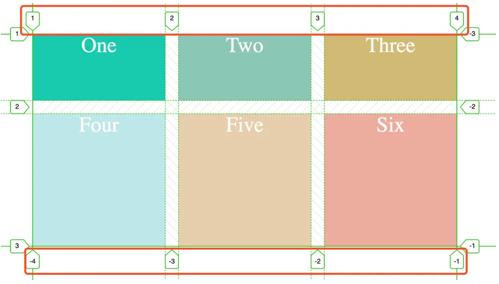

Flex布局是轴线布局，只能指定"项目"针对轴线的位置，可以看作是一维布局，Grid 布局则是将容器划分成“行"和“列”，产生单元格，然后指定"项目所在”的单元格，可以看作是二维布局
# 基本概念
## 容器和项目
### 网格容器（Grid Container）

创建网格布局的第一步是定义一个网格容器。通过将`display`属性设置为`grid`或者`inline-grid`，可以把一个 HTML 元素转变为网格容器。一旦元素成为网格容器，它的直系子元素就会自动成为网格项目。
```
.grid-container {
    display: grid;
    /* 其他网格容器属性 */
}
```

### 网格项目（Grid Items）

网格容器的直系子元素会自动成为网格项目。这些项目会根据网格容器所定义的规则，排列在网格的单元格内。
```
<div class="grid-container">
    <div class="grid-item">项目 1</div>
    <div class="grid-item">项目 2</div>
    <!-- 更多网格项目 -->
</div>
```
### 网格轨道
-   **网格列轨道**：它是指网格中垂直方向上的列空间。在创建网格布局时，你可以使用`grid-template-columns`属性来定义列轨道的数量和尺寸。
-   **网格行轨道**：是网格中水平方向上的行空间，使用`grid-template-rows`属性来定义行轨道的数量和尺寸。

#### 固定宽度
可以为轨道设置固定的像素值。例如：
```
.grid-container {
    display: grid;
    grid-template-columns: 200px 300px;
    grid-template-rows: 150px 200px;
}
```
上述代码创建了一个有两列（宽度分别为 200px 和 300px）和两行（高度分别为 150px 和 200px）的网格布局。

#### 比例分配

使用`fr`单位能按比例分配剩余空间。例如：
```
.grid-container {
    display: grid;
    grid-template-columns: 1fr 2fr;
    grid-template-rows: 1fr 1fr;
}
```
这里第一列占据总宽度的三分之一，第二列占据三分之二；两行则平均分配高度。

#### 重复定义

若轨道尺寸有规律，可使用`repeat()`函数。例如：
```
.grid-container {
    display: grid;
    grid-template-columns: repeat(3, 1fr);
    grid-template-rows: repeat(2, 100px);
}
```
这会创建一个三列（每列宽度相等）和两行（每行高度为 100px）的网格布局。

### 网格线
网格线分为垂直网格线（列网格线）和水平网格线（行网格线）。它们是创建网格布局时自动生成的，用于界定网格轨道的边界。

#### 编号
网格线从 1 开始编号，并且有正向和反向两种编号方式：
-   **正向编号**：列网格线从左到右编号，行网格线从上到下编号。例如，在一个三列的网格中，最左边的列网格线编号为 1，中间的为 2，最右边的为 3，最右边外侧的为 4。
-   **反向编号**：列网格线从右到左编号，行网格线从下到上编号，编号以 -1 开始。在上述三列网格中，最右边的列网格线编号为 -1，中间的为 -2，最左边的为 -3，最左边外侧的为 -4。

#### 使用网格线定位网格项目
可以通过指定网格项目跨越的网格线来精确控制其在网格中的位置和大小。相关属性如下：
- grid-column-start 和 grid-column-end：用于指定网格项目在列方向上的起始和结束网格线。
- grid-row-start 和 grid-row-end：用于指定网格项目在行方向上的起始和结束网格线。
  

# 容器属性
 ## display 属性
 我们通过在元素上声明 display：grid 或 display：inline-grid 来创建一个网格容器。声明 display：grid 则该容器是一个块级元素，设置成 display: inline-grid 则容器元素为行内元素
 - 块级元素：会独自占据一整行空间，无论其内容多少。在页面中，块级元素总是从新的一行开始显示，并且后面的元素也会另起一行。
 - 行内元素：不会另起一行，会在同一行内依次排列，直到该行空间不足才会换行。
## grid-template-columns 属性和 grid-template-rows 属性
grid-template-columns 属性设置列宽，grid-template-rows 属性设置行高
### repeat() 函数
可以简化重复的值。该函数接受两个参数，第一个参数是重复的次数，第二个参数是所要重复的值。
### auto-fill关键字
表示自动填充，让一行（或者一列）中尽可能的容纳更多的单元格。grid-template-columns: repeat(auto-fill, 200px) 表示列宽是 200 px，但列的数量是不固定的，只要浏览器能够容纳得下，就可以放置元素。
### fr 关键字
Grid 布局还引入了一个另外的长度单位来帮助我们创建灵活的网格轨道。fr 单位代表网格容器中可用空间的一等份。grid-template-columns: 200px 1fr 2fr 表示第一个列宽设置为 200px，后面剩余的宽度分为两部分，宽度分别为剩余宽度的 1/3 和 2/3。
### minmax() 函数
我们有时候想给网格元素一个最小和最大的尺寸，minmax() 函数产生一个长度范围，表示长度就在这个范围之中都可以应用到网格项目中。它接受两个参数，分别为最小值和最大值。grid-template-columns: 1fr 1fr minmax(300px, 2fr) 的意思是，第三个列宽最少也是要 300px，但是最大不能大于第一第二列宽的两倍。
### auto关键字
由浏览器决定长度。

## grid-row-gap 、grid-column-gap 、grid-gap 
grid-row-gap 属性、grid-column-gap 属性分别设置行间距和列间距。 grid-gap 属性是两者的简写形式。
## grid-template-areas 
grid-template-areas 属性允许你为网格中的每个区域指定一个名称，然后通过这些名称来定义网格的整体布局。每个名称代表一个或多个相邻的网格单元格，你可以使用这些名称来放置网格项目，而不必手动指定每个项目跨越的网格线。
一般跟网格元素的 grid-area 一起使用
### 语法
grid-template-areas 属性的值是一个由字符串组成的列表，每个字符串代表网格的一行。在每个字符串中，使用空格分隔不同的区域名称，使用 . 表示空单元格。例如：
```
.grid-container {
    display: grid;
    grid-template-areas:
        "header header header"
        "sidebar main main"
        "footer footer footer";
}
```
上述代码定义了一个三行三列的网格布局，其中 header 区域占据第一行的三个单元格，sidebar 区域占据第二行的第一个单元格，main 区域占据第二行的后两个单元格，footer 区域占据第三行的三个单元格。
### 使用
要使用 grid-template-areas 属性，需要完成以下两个步骤：
- 定义网格区域：在网格容器上使用 grid-template-areas 属性来定义网格区域的布局
- 放置网格项目：在网格项目上使用 grid-area 属性来指定该项目应该放置在哪个网格区域中

## grid-auto-flow
grid-auto-flow 属性用于控制网格项目在网格容器中自动布局的方式，当你没有明确指定网格项目的位置时，它会决定项目如何填充网格。
- row（默认值）
项目会按照行优先的顺序依次填充网格。当一行填满后，会自动换行到下一行继续填充。
- column
项目会按照列优先的顺序依次填充网格。当一列填满后，会自动换到下一列继续填充。
- row dense
以行优先的方式填充网格，并且会尝试填充网格中的空白区域。当某个项目因为前面的项目占据空间而无法正常放置时，它会寻找后面合适的空白区域进行填充，以达到更紧凑的布局效果，但可能会打乱项目原本的顺序。
- column dense
以列优先的方式填充网格，同时尝试填充网格中的空白区域。同样可能会打乱项目原本的顺序。

## justify-items
justify-items 属性用于控制网格项目在水平方向（行轴）上的对齐方式，也就是在网格单元格内的水平排列情况。它是应用在网格容器上的，会对所有网格项目生效。
- start：项目在单元格的左侧对齐。
- end：项目在单元格的右侧对齐。
- center：项目在单元格内水平居中对齐。
- stretch（默认值）：项目拉伸以填满整个单元格的宽度。
## align-items
align-items 属性用于控制网格项目在垂直方向（列轴）上的对齐方式，即项目在网格单元格内的垂直排列情况。同样，它也是应用在网格容器上，对所有网格项目生效。
- start：项目在单元格的顶部对齐。
- end：项目在单元格的底部对齐。
- center：项目在单元格内垂直居中对齐。
- stretch（默认值）：项目拉伸以填满整个单元格的高度。
  
## place-items
place-items 属性是 align-items 和 justify-items 的简写属性，它可以同时设置项目在垂直和水平方向上的对齐方式。
```
place-items: <align-items> <justify-items>;
```
## justify-content
justify-content 属性用于控制网格轨道在水平方向（行轴）上的对齐和分布方式。它应用于网格容器，影响整个网格轨道的排列。
- start：网格轨道从网格容器的左侧开始排列。
- end：网格轨道从网格容器的右侧开始排列。
- center：网格轨道在网格容器内水平居中排列。
- stretch：网格轨道拉伸以填满网格容器的宽度。
- space-between：网格轨道均匀分布，轨道之间的间距相等，且第一个轨道与容器左侧、最后一个轨道与容器右侧紧密贴合。
- space-around：网格轨道均匀分布，每个轨道两侧的间距相等，轨道之间的间距是轨道与容器边缘间距的两倍。
- space-evenly：网格轨道均匀分布，所有轨道之间以及轨道与容器边缘的间距都相等。
## align-content
align-content 属性用于控制网格轨道在垂直方向（列轴）上的对齐和分布方式。它同样应用于网格容器，影响整个网格轨道的垂直排列。
与 justify-content 类似，包括 start、end、center、stretch、space-between、space-around 和 space-evenly，只是方向变为垂直方向。
## place-content
place-content 属性是 align-content 和 justify-content 的简写属性，它可以同时设置网格轨道在垂直和水平方向上的对齐和分布方式。
```
place-content: <align-content> <justify-content>;
```
## grid-auto-columns 、grid-auto-rows
 用于定义隐式创建的网格轨道的大小。当你明确指定的网格轨道不足以容纳所有网格项目时，就会自动创建隐式的网格轨道，这两个属性就是用来控制这些隐式轨道的尺寸的。

 # 项目属性
 ## grid-column-start 属性、grid-column-end 属性、grid-row-start 属性以及grid-row-end 属性
 可以指定网格项目所在的四个边框，分别定位在哪根网格线，从而指定项目的位置
- grid-column-start 属性：左边框所在的垂直网格线
- grid-column-end 属性：右边框所在的垂直网格线
- grid-row-start 属性：上边框所在的水平网格线
- grid-row-end 属性：下边框所在的水平网格线
  
  ## grid-area
  指定项目放在哪一个区域

## justify-self 、align-self 以及 place-self 
justify-self 属性设置单元格内容的水平位置（左中右），跟 justify-items 属性的用法完全一致，但只作用于单个项目
align-self 属性设置单元格内容的垂直位置（上中下），跟align-items属性的用法完全一致，也是只作用于单个项目
