# Flex 布局详解

Flex 布局是一种用于实现灵活响应式布局的 CSS 模型。使用它可以方便地控制元素的排列方向、对齐方式及自动换行。

## 一、基本概念

*   **Flex 容器（Container）** ：应用了 `display: flex;` 的元素。

*   **Flex 项目（Item）** ：容器的所有子元素。

*   **轴的概念**：

    *   **主轴（main axis）** ：默认是水平方向。
    *   **交叉轴（cross axis）** ：与主轴垂直的方向。
       
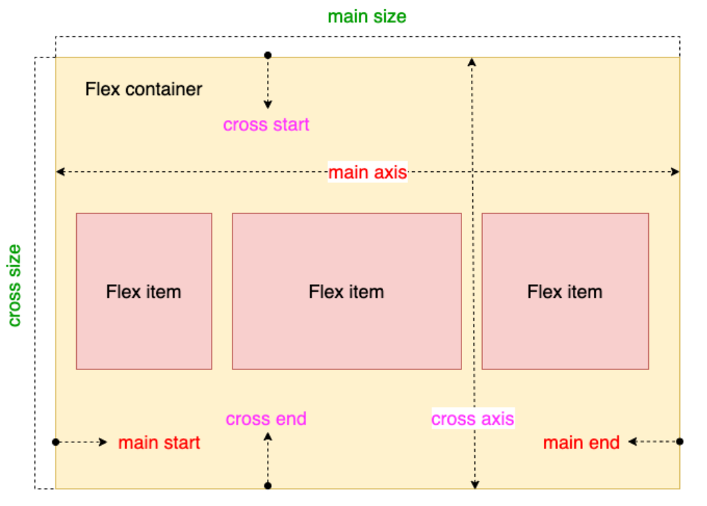
```

    .container {
      display: flex;
    }
```
***

## 二、主轴方向：`flex-direction`

控制项目在主轴上的排列方向：

    .container {
      flex-direction: row | row-reverse | column | column-reverse;
    }

*   `row`（默认）：从左到右
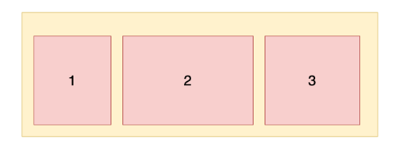
*   `row-reverse`：从右到左

*   `column`：从上到下
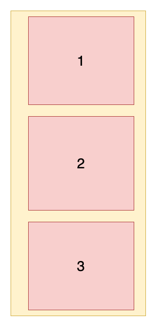
*   `column-reverse`：从下到上

***

## 三、是否换行：`flex-wrap`

控制当项目总宽/高超出容器时是否换行：

    .container {
      flex-wrap: nowrap | wrap | wrap-reverse;
    }

*   `nowrap`（默认）：不换行，项目可能压缩
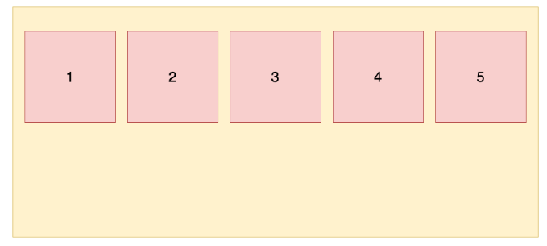
*   `wrap`：自动换行，第一行在上
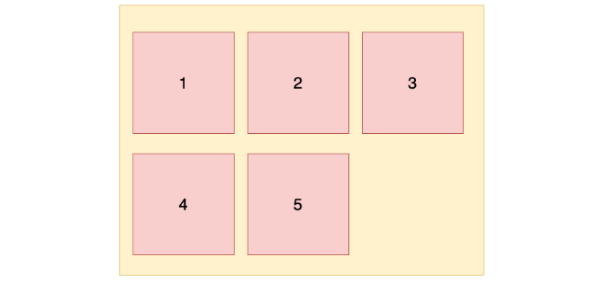
*   `wrap-reverse`：自动换行，第一行在下
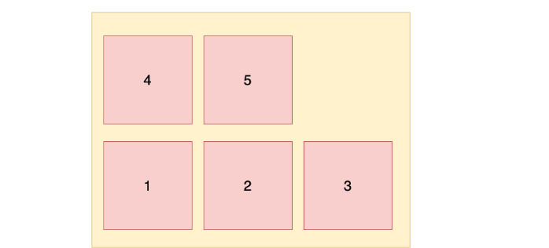
***

## 四、主轴对齐：`justify-content`

控制项目在主轴上的对齐方式：

    .container {
      justify-content: flex-start | flex-end | center | space-between | space-around;
    }

*   `flex-start`（默认）：起点对齐
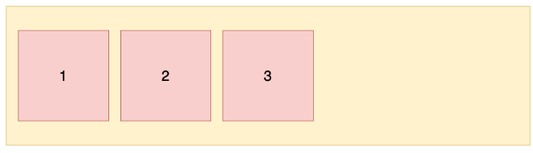
*   `flex-end`：终点对齐
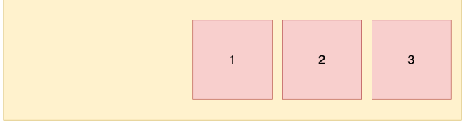
*   `center`：居中对齐
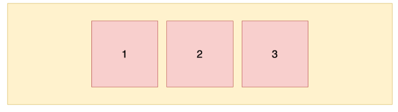
*   `space-between`：两端对齐，间隔平均
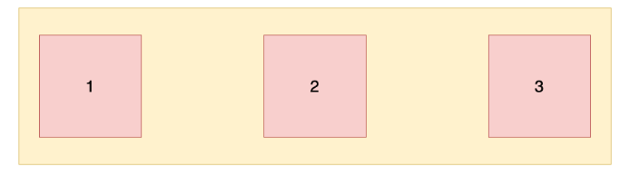
*   `space-around`：两侧间距相等，项目之间间隔更大
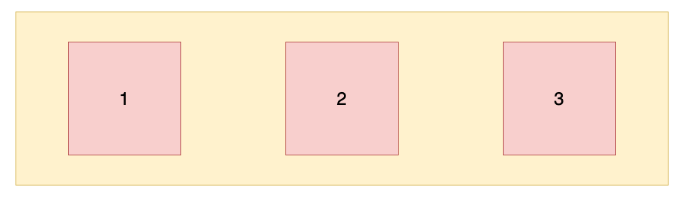

***

## 五、交叉轴对齐：`align-items`

控制项目在交叉轴上的对齐方式：

    .container {
      align-items: stretch | flex-start | flex-end | center | baseline;
    }

*   `stretch`（默认）：未设置尺寸时，项目拉伸填满容器高度
*   `flex-start`：顶部对齐
*   `flex-end`：底部对齐
*   `center`：居中对齐
*   `baseline`：以文本基线对齐

***

## 六、多行对齐：`align-content`

align-content：多根轴线对齐方式。如果元素只有一根轴线，该属性不起作用。它有六个属性值：
```js
.container {
    align-content:  stretch | flex-start | flex-end | center | space-between | space-around ;
}
```
那这个轴线数怎么确定呢？实际上这主要是由flex-wrap属性决定的，当flex-wrap 设置为 nowrap 时，容器仅存在一根轴线，因为项目不会换行，就不会产生多条轴线。当 flex-wrap 设置为 wrap 时，容器可能会出现多条轴线，这时就需要去设置多条轴线之间的对齐方式。

这里以水平方向为主轴时举例，即：flex-direction: row; flex-wrap: wrap;
## stretch
默认值，轴线占满整个交叉轴。这里我们先设置每个项目都是固定宽度，效果如下：
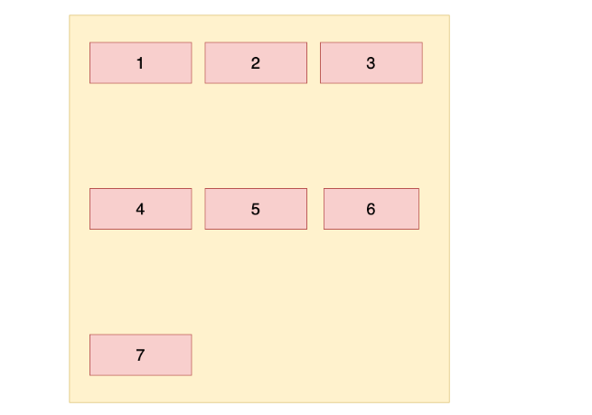
下面就去掉每个项目的高度，它会占满整个交叉轴，效果如下：
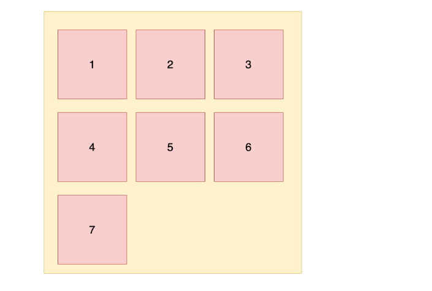
##  flex-start
从交叉轴开始位置填充
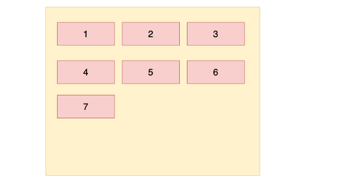
##  flex-end
从交叉轴结尾位置填充
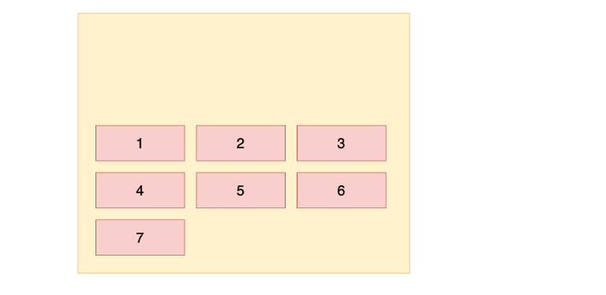
## center
与交叉轴中点对齐
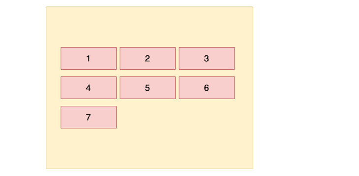
## space-between
与交叉轴两端对齐，轴线之前的间隔平均分布
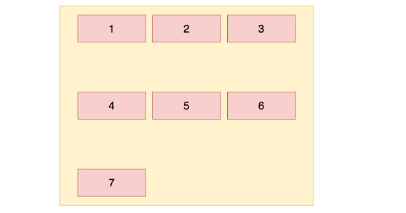
## space-around
每根轴线两侧的间隔都相等。所以，轴线之间的间隔比轴线与边框的间隔大一倍
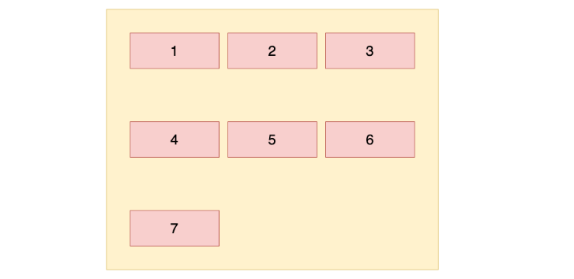


## 七、项目属性

### 1. `order`：排序权重

    .item {
      order: number; /* 默认 0，越小越靠前 */
    }

***

### 2. `flex-grow`：放大比例

    .item {
      flex-grow: number; /* 默认 0，存在剩余空间时是否放大 */
    }

***

### 3. `flex-shrink`：缩小比例

    .item {
      flex-shrink: number; /* 默认 1，空间不足时是否缩小 */
    }

***

### 4. `flex-basis`：主轴初始尺寸

    .item {
      flex-basis: <length> | auto;
    }

***

### 5. `flex`：简写形式

    .item {
      flex: none | [ <flex-grow> <flex-shrink>? || <flex-basis> ];
    }

常见写法：

*   `flex: 0 1 auto`（默认值）
*   `flex: none` 等价于 `0 0 auto`
*   `flex: 0` 等价于 `0 1 0%`
*   `flex: auto` 等价于 `1 1 auto`
*   `flex: 1` 等价于 `1 1 0%`

***

### 6. `align-self`：项目单独设置对齐方式

    .item {
      align-self: auto | flex-start | flex-end | center | baseline | stretch;
    }

用于覆盖容器的 `align-items` 设置。

