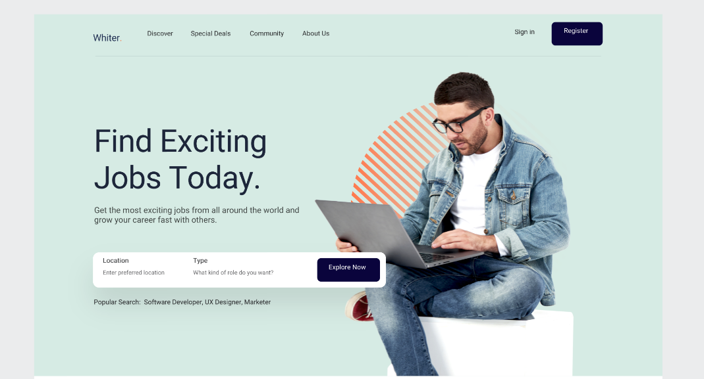

# 卡片式布局
卡片式页面布局可以在放置大量信息的同时，又让页面看起来非常规整有序。卡片式布局的卡片设置一般会有两种形式，一种都是尺寸相同的卡片，排列标准；还有一种是放置不同尺寸的卡片，非常个性。

# 分栏式布局
当图片和文字一样重要时，就会设计分栏式布局，左边是图片，右边是文字，简单又实用，很适合一些电商网站上用来展示产品的信息。

# 网格式布局
网格式布局是很规整的页面布局方式，把页面的内容，分成大小一样的网格，让人第一眼看上去感觉就很整齐，也更加方便用户寻找信息，对于一些内容分散、信息杂乱的网页来说，这种页面布局非常实用。

# 单栏式布局
单栏式布局顾名思义就是把信息都放在同一个页面上，通过滚动完成导航。对于信息比较少的网页来说，是一个很好的选择，可以让用户使用时有一种沉浸感。
# 大标题布局
大标题布局也是非常流行的一个网页页面布局，经常会在一些网站的首页看到，大号的字体不仅可以带给用户视觉冲击，也可以营造一种极简主义的风格。

# F型布局
F 型布局是很多网站首页的页面布局，根据研究表明，用户在看网页的时候，习惯从左到右的顺序向下阅读，所以F 型布局有很强的视觉结构
