# 递归
## 1，排列问题
### 算法思想：
1.  **固定位置**：从第一个位置开始，依次选择每个可能的元素固定在当前位置。
1.  **递归生成**：固定当前位置后，递归处理剩余的位置。
1.  **回溯恢复**：尝试完一种可能性后，撤销当前选择（回溯），以便尝试其他可能性。
### 算法步骤
以输入数组 `[a, b, c]` 为例，生成全排列的过程如下：

1.  **初始状态**：数组为 `[a, b, c]`，当前处理位置 `k=0`。

1.  **固定位置 0**：

    -   选择 `a`（位置 0 与自身交换，数组不变），递归处理位置 1：

        -   固定位置 1：选择 `b`（数组 `[a, b, c]`），递归处理位置 2 → 输出 `abc`。
        -   固定位置 1：选择 `c`（交换位置 1 和 2，数组变为 `[a, c, b]`），递归处理位置 2 → 输出 `acb`。

    -   选择 `b`（交换位置 0 和 1，数组变为 `[b, a, c]`），递归处理位置 1：

        -   固定位置 1：选择 `a`（数组 `[b, a, c]`），递归处理位置 2 → 输出 `bac`。
        -   固定位置 1：选择 `c`（交换位置 1 和 2，数组变为 `[b, c, a]`），递归处理位置 2 → 输出 `bca`。

    -   选择 `c`（交换位置 0 和 2，数组变为 `[c, b, a]`），递归处理位置 1：

        -   固定位置 1：选择 `b`（数组 `[c, b, a]`），递归处理位置 2 → 输出 `cba`。
        -   固定位置 1：选择 `a`（交换位置 1 和 2，数组变为 `[c, a, b]`），递归处理位置 2 → 输出 `cab`。

1.  **回溯恢复**：每次递归返回后，将数组恢复为交换前的状态，确保后续尝试的正确性。
### 剪枝
**为什么要检查arr[i]是否在[k, i)范围内已出现，避免生成重复排列**
当输入数组包含重复元素时，可能会生成重复的排列。为避免这种情况，代码在选择当前位置的元素时增加了去重检查：
-   **检查条件**：在选择位置 `i` 的元素固定到位置 `k` 之前，检查该元素是否已在 `[k, i)` 范围内出现过。
-   **剪枝逻辑**：如果已出现过，则跳过当前选择，避免生成重复排列。
例如，对于输入 `[a, a, b]`：
-   当固定位置 0 为 `a` 后，递归处理位置 1 时，会跳过第二个 `a`（因为位置 0 已经选过 `a`），从而避免生成重复的 `aab`。
### 分析
-   **时间复杂度**：\(O(n!)\)，其中 n 是数组长度。生成全排列的数量为 \(n!\)，每个排列需要 \(O(n)\) 的时间输出。
-   **空间复杂度**：\(O(n)\)，主要用于递归栈的空间（递归深度为 n）和数组本身的存储。
```c++
#include<iostream>
#include<vector>
using namespace std;

// 交换数组中两个位置的元素
void swap(vector<char>& arr, int k, int m) {
    char tem = arr[k];
    arr[k] = arr[m];
    arr[m] = tem;
}

/**
 * 生成数组中从索引k到m的全排列
 * @param arr 输入的字符数组
 * @param k 当前处理的起始位置
 * @param m 数组的长度
 */
void perm(vector<char>& arr, int k, int m) {
    // 当k等于m时，表示已经处理完所有位置，输出当前排列
    if (k == m) {
        // 注意：这里应该遍历到m-1，因为数组索引从0开始
        for (int i = 0; i < m; i++) {
            cout << arr[i];
        }
        cout << endl;
        return;
    }

    // 遍历从k到m-1的所有位置
    for (int i = k; i < m; i++) {
        // 检查arr[i]是否在[k, i)范围内已出现，避免生成重复排列
        bool duplicate = false;
        for (int j = k; j < i; j++) {
            if (arr[j] == arr[i]) {
                duplicate = true;
                break;
            }
        }
        if (duplicate) continue; // 如果存在重复，则跳过当前元素

        // 将arr[i]与arr[k]交换，固定当前位置k的元素
        swap(arr, k, i);
        // 递归生成从k+1到m的全排列
        perm(arr, k + 1, m);
        // 回溯操作，将元素交换回原来的位置
        swap(arr, k, i);
    }
}

int main() {
    int n;
    cin >> n; // 输入字符的数量
    vector<char> arr(n); // 创建大小为n的字符数组

    // 输入n个字符
    for (int i = 0; i < n; i++) {
        cin >> arr[i];
    }

    // 生成并输出所有排列
    perm(arr, 0, n);

    return 0;
}
```
## 2. 汉诺塔Hanoi问题
基本思路: 
- 当只有一个圆盘时，直接将其从 A 柱移动到 C 柱。
- 当有 n 个圆盘时，可以把问题分解为三个步骤：
  - 先将 A 柱上的 n - 1 个圆盘借助 C 柱移动到 B 柱。
  - 然后把 A 柱上剩下的一个圆盘（即最大的圆盘）直接移动到 C 柱。
  - 最后再将 B 柱上的 n - 1 个圆盘借助 A 柱移动到 C 柱。


# 分治
-   **分解**：将原问题分解为若干个子问题，子问题的规模尽量相等，且子问题的结构与原问题相同。
-   **解决**：递归地求解每个子问题。如果子问题的规模足够小，则直接求解。
-   **合并**：将子问题的解合并成原问题的解。
## 1. 二分搜索
基本思想：
正常二分将一个完整的区间分成两个区间，两个区间本应单独找值然后确认结果，但是通过有序的区间可以直接确定结果在那个区间，所以分的两个区间只需要计算其中一个区间，然后继续进行一直到结束。
```c
int binarySearch(int nums[], int target,int n){
    int left=0,right=n-1;
    while(left<right) {
        int mid=(left+right)/2;
        if(nums[mid] == target) return mid;
        else if(nums[mid]>target) right=mid-1;
        else left=mid+1;
    }
    return -1;
}
```
## 2. 快速排序
### 基本思想：
通过选择一个基准值，将待排序数组分为两部分，使得左边部分的元素都小于等于基准值，右边部分的元素都大于等于基准值，然后递归地对左右两部分进行排序，最终使整个数组有序。
### 算法步骤：
1.  **选择基准值**：从数组中选择一个元素作为基准值（通常选择第一个元素、最后一个元素或中间元素等）。

2.  **划分操作**：使用双指针法，从数组的两端开始向中间扫描。设置两个指针，一个指向数组的起始位置（`left`），一个指向数组的末尾位置（`right`）。

    -   首先，从右向左移动 `right` 指针，找到第一个小于基准值的元素。
    -   然后，从左向右移动 `left` 指针，找到第一个大于基准值的元素。
    -   交换 `left` 和 `right` 指向的元素。
    -   重复上述步骤，直到 `left` 和 `right` 相遇。此时，基准值左边的元素都小于等于基准值，右边的元素都大于等于基准值。

3.  **递归排序**：将数组分为基准值左边和右边两部分，递归地对这两部分重复上述步骤，直到子数组的长度为 1 或 0，此时数组已经完全有序。
### 分析
情况 | 时间复杂度      | 空间复杂度    |
| -- | ---------- | -------- |
| 最优 | O(n log n) | O(log n) |
| 平均 | O(n log n) | O(log n) |
| 最坏 | O(n²)      | O(n)
```c
void quickSort(int arr[], int left, int right) {
    if (left >= right) return;  // 递归终止条件
    
    int pivot = arr[left];      // 选择最左元素作为基准值
    int low = left, high = right;    // 使用双指针i和j
    
    while (low < high) {
        // 从右向左找第一个小于基准的元素
        while (low < high && arr[high] >= pivot) high--;
        arr[low] = arr[high];
        
        // 从左向右找第一个大于基准的元素
        while (low < high && arr[low] <= pivot) low++;
        arr[high] = arr[low];
    }
    
    arr[low] = pivot;             // 基准值归位
    quickSort(arr, left, low-1);   // 递归排序左半部分
    quickSort(arr, low+1, right);  // 递归排序右半部分
}
```
## 3. 归并排序
算法步骤：
1.  **分解阶段**

    -   找出数组的中间位置，把数组分成左右两部分。
    -   递归地对左右两部分子数组执行分解操作，直至子数组只有一个元素。

1.  **合并阶段**

    -   创建一个临时数组用于存放合并后的结果。
    -   比较左右两个子数组的元素，依次把较小的元素放入临时数组。
    -   若某个子数组的元素全部放入临时数组后，另一个子数组还有剩余元素，就把这些剩余元素直接复制到临时数组的末尾。
    -   把临时数组中的元素复制回原数组的对应位置。
```c
void mergeSort(int arr[],int left,int right){
    int mid=(left+right)/2;
    if(left<right){
        mergeSort(arr,left,mid);
        mergeSort(arr,mid+1,right);
        merge(arr,left,mid,right);
    }
}

void merge(int arr[],int left,int mid,int right){
    int l=left,r=mid+1;
    int tem[right-left];
    int t=0;
    while(l<=mid&&r<=right){
        if(arr[l]<=arr[r]){
            tem[t++]=arr[l++];
        }
        else{
            tem[t++]=arr[r++];
        }
    }
    while(l<=mid){
        tem[t++]=arr[l++];
    }
    while(r<=right){
        tem[t++]=arr[r++];
    }
    for(int i=0;i<t;i++){
        arr[i]=tem[i];
    }
}
```
## 4. 最大子序列和
最大子序列和问题是指在一个整数序列中，找出一个连续的子序列，使得该子序列中所有元素的和最大。
分治算法思想：
将原序列从中间分成左右两部分，那么最大子序列和可能出现在以下三种情况中：

1.  **完全位于左半部分**：最大子序列完全在原序列的左半部分。
1.  **完全位于右半部分**：最大子序列完全在原序列的右半部分。
1.  **跨越中间位置**：最大子序列跨越了原序列的中间位置，一部分在左半部分，一部分在右半部分。

分别递归地求解左半部分和右半部分的最大子序列和，再单独计算跨越中间位置的最大子序列和，最后取这三个结果中的最大值作为原问题的解。
### 算法步骤

1.  **分解问题**：将数组从中间分为左右两部分。

1.  **递归求解**：分别计算左子数组和右子数组的最大和。

1.  **处理跨越中点的情况**：

    -   从中点向左扩展，找到以中点为终点的最大和 `leftBest`。
    -   从中点向右扩展，找到以中点后一位为起点的最大和 `rightBest`。
    -   合并两部分的和 `crossMax = leftBest + rightBest`。

1.  **合并结果**：取三者中的最大值作为最终结果。
### 分析
-   **时间复杂度**：\(O(n \log n)\) 每次递归将问题规模减半（分治），但计算跨越中点的和需要遍历整个数组，因此每层递归的时间为 \(O(n)\)，总递归深度为 \(O(\log n)\)。
-   **空间复杂度**：\(O(\log n)\) 递归栈的深度为树的高度 \(O(\log n)\)
```c++
#include <iostream>
#include <algorithm> // 用于 max 函数
using namespace std;

int maxSubarray(int arr[], int left, int right) {
    // 基本情况：只有一个元素
    if (left == right) return arr[left];
    
    int mid = (left + right) / 2;
    
    // 递归求左右子数组的最大和
    int leftMax = maxSubarray(arr, left, mid);
    int rightMax = maxSubarray(arr, mid + 1, right);
    
    // 计算跨越中点的最大子数组和
    int crossMax = 0;
    
    // 向左扩展的最大和
    int leftSum = 0, leftBest = arr[mid];
    for (int i = mid; i >= left; i--) {
        leftSum += arr[i];
        leftBest = max(leftBest, leftSum);
    }
    
    // 向右扩展的最大和
    int rightSum = 0, rightBest = arr[mid + 1];
    for (int i = mid + 1; i <= right; i++) {
        rightSum += arr[i];
        rightBest = max(rightBest, rightSum);
    }
    
    // 合并结果
    crossMax = leftBest + rightBest;
    return max({leftMax, rightMax, crossMax});
}

// 测试代码
int main() {
    int arr[] = {-2, 1, -3, 4, -1, 2, 1, -5, 4};
    int n = sizeof(arr) / sizeof(arr[0]);
    
    int result = maxSubarray(arr, 0, n - 1);
    cout << "最大子数组和为: " << result << endl;
    
    return 0;
}
```
### 动态规划解法：
动态规划递推方程：
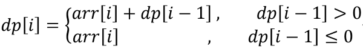
 最大子数组的起始位置rec[] 的方程：
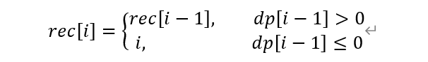
其实可以简单地理解成我们在当前的状态下**是否抛弃前面部分的最大累加和**。  
当我们前半部分最大累加和 ***dp[i-1]** * 是一个正数，那么我们当前元素 ***arr[i]** * 加上它，就是当前以 ***i*** 为结尾的最大累加和，此时就是 ***dp[i] = arr[i] + dp[i - 1]** *；  
当我们前半部分最大累加和 ***dp[i-1]** * 都已经是一个负值(或者0)了，那么我们当前元素 ***arr[i]** * 加上它只会让当前以 ***i*** 为结尾的最大累加和更小，所以我们要丢弃它，从新的起点下标开始，也就是此时的 ***dp[i] = arr[i]** *。
```c
#include <iostream>
#include <climits>
using namespace std;

void findMaxSubarray(int arr[], int n) {
    if (n == 0) return;
    
    int maxSum = arr[0];        // 最大和
    int currentSum = arr[0];    // 当前子数组和
    int start = 0, end = 0;     // 最大子数组的起止位置
    int tempStart = 0;          // 临时起始位置
    
    for (int i = 1; i < n; i++) {
        // 如果当前和小于0，重新开始子数组
        if (currentSum < 0) {
            currentSum = arr[i];
            tempStart = i;
        } 
        // 否则继续扩展当前子数组
        else {
            currentSum += arr[i];
        }
        
        // 更新最大和及位置
        if (currentSum > maxSum) {
            maxSum = currentSum;
            start = tempStart;
            end = i;
        }
    }
    
    cout << "最大和: " << maxSum << " 起始: " << start << " 结束: " << end << endl;
}

// 测试代码
int main() {
    int arr[] = {-2, 1, -3, 4, -1, 2, 1, -5, 4};
    int n = sizeof(arr)/sizeof(arr[0]);
    
    findMaxSubarray(arr, n);
    
    return 0;
}
```
时间复杂度O(n)
## 5. 大整数乘法
设有两个大整数X,Y; 是n位十进制整数，分段表示如下:
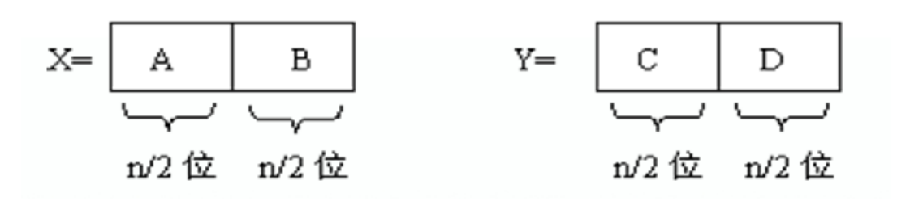
则可以得到：
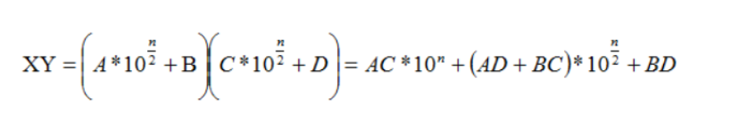
进一步优化得：
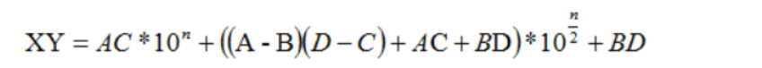
分治递归具体步骤：
1.  **基例**：如果 x 和 y 的长度足够小（例如长度为 1），直接返回它们的乘积。

1.  **分解**：将 x 和 y 分解为 a,b,c,d。

1.  **递归计算**：

    -   计算 a⋅c
    -   计算 b⋅d
    -   计算 (a-b)⋅(c-d)

1.  **组合结果**：
    -   x⋅y=a⋅c⋅10^n^+[(a-b)⋅(c-d)+a⋅c+b⋅d]⋅10^n/2^+b⋅d

## 6. Strassen矩阵乘法
 **算法步骤**

1.  **矩阵分块**  
    将两个矩阵 A 和 B 分解为四个子矩阵：

  $
  A=
 \begin{bmatrix}
 A11&A12\\
 A21&A22\\
 \end{bmatrix}  
 B=
 \begin{bmatrix}
 B11&B12\\
 B21&B22\\
 \end{bmatrix}
 $
 

1.  **递归计算中间乘积**  
    使用以下公式计算 7 个中间乘积（M1 到 M7）：
    

2.  **组合结果矩阵**  
    使用中间乘积构造最终结果矩阵 C：

   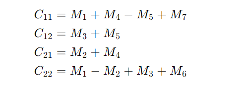

3.  **递归终止条件**  
    当矩阵的大小为 2×2 时，直接使用传统矩阵乘法计算

## 7. 棋盘覆盖问题
**棋盘覆盖**：用4种不同形态的L型骨牌覆盖一个给定的特殊棋盘（即特殊方格的位置已经确定了）上除特殊方格外的所有方格，且任何两个L型骨牌不得重复覆盖。按照规则，我们很容易知道，在2^k*2^k的棋盘覆盖中，用到的L型骨盘数恰为（4^k-1)/3,即（所有方格个数-特殊方格个数）/3。  
算法步骤：
1. 当k>0时，将2^k*2^k棋盘分割为4个2^(k-1)*2^(k-1)子棋盘，如图所示：
   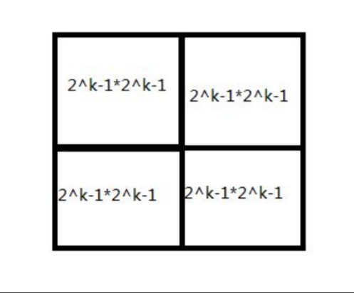
2.  特殊方格必定位于这四个小棋盘中，其余三个子棋盘没有特殊方格，为了将这三个无特殊方格的子棋盘转换为特殊棋盘，我们可以用一个L型骨盘覆盖这三个较小棋盘的会合处，如图所示：
   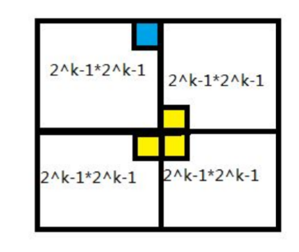
3.   从图上可以看出，这三个子棋盘上被L型骨牌覆盖的方格就成为该棋盘上的特殊方格，从而将问题分解为4个较小规模的棋盘覆盖问题。递归地使用这种分割方法，直至棋盘简化为1*1棋盘，就结束递归。
```c
#include <iostream>
using namespace std;

int tileID = 0; // 全局骨牌编号
int board[100][100]; // 棋盘数组

// 棋盘覆盖函数
// topRow, leftCol: 当前处理的子棋盘的左上角坐标
// specialRow, specialCol: 特殊方格的坐标
// size: 当前子棋盘的大小（边长）
void coverBoard(int topRow, int leftCol, int specialRow, int specialCol, int size) {
    // 基线条件：棋盘大小为1时直接返回
    if (size == 1) return;

    int half = size / 2; // 子棋盘大小
    int id = ++tileID;   // 当前使用的骨牌ID

    // 计算子棋盘边界
    int midRow = topRow + half;
    int midCol = leftCol + half;

    // 处理四个象限的递归覆盖
    // 每个象限的三元组含义：
    // [0]: 特殊方格是否在此象限
    // [1]: 若不在此象限，放置骨牌的行坐标
    // [2]: 若不在此象限，放置骨牌的列坐标
    const int quadrants[4][3] = {
        {specialRow < midRow && specialCol < midCol, midRow - 1, midCol - 1}, // 左上
        {specialRow < midRow && specialCol >= midCol, midRow - 1, midCol},   // 右上
        {specialRow >= midRow && specialCol < midCol, midRow, midCol - 1},   // 左下
        {specialRow >= midRow && specialCol >= midCol, midRow, midCol}     // 右下
    };

    // 处理四个子棋盘
    for (int q = 0; q < 4; q++) {
        int startR = topRow + (q / 2) * half; // 子棋盘起始行
        int startC = leftCol + (q % 2) * half; // 子棋盘起始列

        if (quadrants[q][0]) {
            // 特殊方格在此象限，继续递归处理该子棋盘
            coverBoard(startR, startC, specialRow, specialCol, half);
        }
        else {
            // 特殊方格不在此象限，放置一个L型骨牌
            board[quadrants[q][1]][quadrants[q][2]] = id;
            // 将骨牌放置位置作为新的特殊方格，继续递归处理
            coverBoard(startR, startC, quadrants[q][1], quadrants[q][2], half);
        }
    }
}

// 打印棋盘
void printBoard(int size) {
    for (int i = 0; i < size; i++) {
        for (int j = 0; j < size; j++) {
            cout << board[i][j] << "\t";
        }
        cout << endl;
    }
}

// 测试代码
int main() {
    int size = 4; // 棋盘大小 (2^k)
    int specialRow = 1, specialCol = 1; // 特殊方格位置

    // 初始化特殊方格
    board[specialRow][specialCol] = 0;

    // 覆盖棋盘
    coverBoard(0, 0, specialRow, specialCol, size);

    // 打印结果
    printBoard(size);

    return 0;
}
```
## 8. 线性时间选择
### 问题描述
给定线性序集中n个元素和一个正数k，1 ≤ k ≤ n ，要求找出这n个元素中第k小的元素
注意：n中的元素不重复
### RandomizedSelect
RandomizedSelect 是一种基于快速选择（Quickselect）的随机化算法，用于在未排序的数组中找到第 k 小的元素。其核心思想是通过随机选择一个枢轴（pivot），将数组划分为两部分，然后根据枢轴的位置递归处理相应的子数组。
算法原理：
1.  **随机选择枢轴**：从数组中随机选择一个元素作为枢轴。

1.  **划分数组**：将数组划分为两部分，一部分包含小于枢轴的元素，另一部分包含大于枢轴的元素。

1.  **确定枢轴的排名**：

    -   如果枢轴的排名等于 k，则返回该枢轴。
    -   如果枢轴的排名大于 k，则递归处理左子数组。
    -   如果枢轴的排名小于 k，则递归处理右子数组，并在右子数组中查找第 (k - 排名) 小的元素。
```c
#include <iostream>
#include <cstdlib>
#include <ctime>
using namespace std;

// 划分函数：将数组分为两部分，左边部分小于等于枢轴，右边部分大于枢轴
// 返回值：枢轴最终所在的位置
int partition(int arr[], int left, int right) {
    int low = left, int high = right;
    int pivot = arr[right];
    while (low < high) {
        while (low < high && arr[low] <= pivot)low++;
        arr[high] = arr[low];
        while (low < high && arr[high] >= pivot)high--;
        arr[low] = arr[high];
    }
    arr[high] = pivot;
    return high;
}

// 随机选择枢轴并划分：通过随机化减少最坏情况的概率
int randomPartition(int arr[], int left, int right) {
    // 随机选择一个位置作为枢轴
    int random = left + rand() % (right - left + 1);
    // 将随机选择的枢轴交换到最右侧
    int tem = arr[random];
    arr[random] = arr[right];
    arr[right] = tem;
    // 调用标准划分函数
    return partition(arr, left, right);
}

// 随机选择算法：在arr[left..right]范围内查找第k小的元素
// k的含义：从小到大排序后第k个位置的元素（k从1开始）
int quickSelect(int arr[], int left, int right, int k) {
    // 基线条件：当子数组只有一个元素时，直接返回该元素
    if (left == right) return arr[left];

    // 随机划分并获取枢轴位置
    int pivotIdx = randomPartition(arr, left, right);
    // 计算枢轴在当前子数组中的顺序（从1开始）
    int order = pivotIdx - left + 1;

    // 三种情况处理：
    if (k == order)
        return arr[pivotIdx]; // 枢轴恰好是第k小元素
    else if (k < order)
        return quickSelect(arr, left, pivotIdx - 1, k); // 在左半部分继续查找
    else
        return quickSelect(arr, pivotIdx + 1, right, k - order); // 在右半部分继续查找
}

// 测试代码
int main() {
    srand(time(0)); // 初始化随机种子，确保每次运行产生不同的随机序列

    int arr[] = { 7, 10, 4, 3, 20, 15 };
    int n = sizeof(arr) / sizeof(arr[0]);
    int k = 3; // 查找第3小的元素

    cout << "第" << k << "小元素是: "
        << quickSelect(arr, 0, n - 1, k) << endl;

    return 0;
}

```

### Select
算法原理：
1.  **分组**：将数组分成若干个大小为 5 的子组（最后可能有一个不足 5 个元素的子组）。

1.  **求中位数**：对每个子组进行插入排序，找到每个子组的中位数。

1.  **递归找中位数**：将所有子组的中位数组成一个新的数组，递归调用 Select 找到这些中位数的中位数，作为枢轴。

1.  **划分数组**：以枢轴为基准，将数组划分为小于枢轴、等于枢轴和大于枢轴的三部分。

1.  **递归处理**：

    -   如果枢轴的排名等于 k，则返回枢轴。
    -   如果枢轴的排名大于 k，则递归处理左子数组。
    -   如果枢轴的排名小于 k，则递归处理右子数组
```c
// 插入排序辅助函数
void insertionSort(int arr[], int left, int right) {
    for (int i = left + 1; i <= right; i++) {
        int key = arr[i];
        int j = i - 1;
        while (j >= left && arr[j] > key) {
            arr[j + 1] = arr[j];
            j--;
        }
        arr[j + 1] = key;
    }
}

// 找中位数的中位数作为枢轴
int medianOfMedians(int arr[], int left, int right) {
    int n = right - left + 1;
    int numMedians = (n + 4) / 5; // 每组 5 个元素
    
    if (numMedians == 1) {
        insertionSort(arr, left, right);
        return arr[(left + right) / 2];
    }
    
    for (int i = 0; i < numMedians; i++) {
        int subLeft = left + i * 5;
        int subRight = subLeft + 4;
        if (subRight > right)
            subRight = right;
        insertionSort(arr, subLeft, subRight);
        int median = subLeft + (subRight - subLeft) / 2;
        // 将中位数移到前面
        int temp = arr[median];
        arr[median] = arr[left + i];
        arr[left + i] = temp;
    }
    
    return medianOfMedians(arr, left, left + numMedians - 1);
}

// 划分函数
int partitionUsingMedian(int arr[], int left, int right, int pivot) {
    int temp = arr[right];
    arr[right] = pivot;
    arr[left] = temp;
    
    int i = left;
    for (int j = left + 1; j <= right; j++) {
        if (arr[j] < pivot) {
            i++;
            temp = arr[i];
            arr[i] = arr[j];
            arr[j] = temp;
        }
    }
    temp = arr[i];
    arr[i] = arr[right];
    arr[right] = temp;
    return i;
}

// Select 算法
int select(int arr[], int left, int right, int k) {
    if (left == right)
        return arr[left];
    
    int pivot = medianOfMedians(arr, left, right);
    int pivotIndex = partitionUsingMedian(arr, left, right, pivot);
    
    int rank = pivotIndex - left + 1;
    if (k == rank)
        return arr[pivotIndex];
    else if (k < rank)
        return select(arr, left, pivotIndex - 1, k);
    else
        return select(arr, pivotIndex + 1, right, k - rank);
}

```
## 9. 循环赛日程问题
**问题描述** ：
假设有 n 个选手参加循环赛，要求每个选手都要与其他 n-1 个选手比赛一次。比赛需要进行 n-1 天，每天每个选手只比赛一次。
**算法步骤**
  按分治策略，我们可以将所有的选手分为两半，则n个选手的比赛日程表可以通过n/2个选手的比赛日程表来决定。递归地用这种一分为二的策略对选手进行划分，直到只剩下两个选手时，比赛日程表的制定就变得很简单。这时只要让这两个选手进行比赛就可以了。
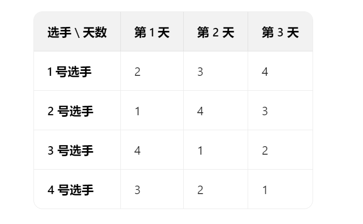
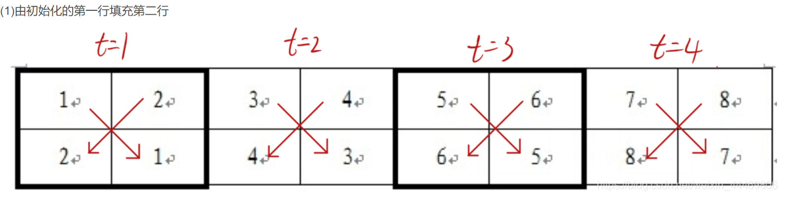
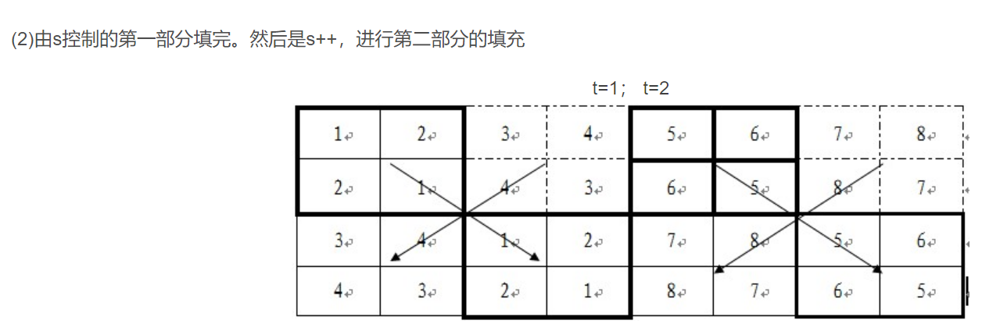
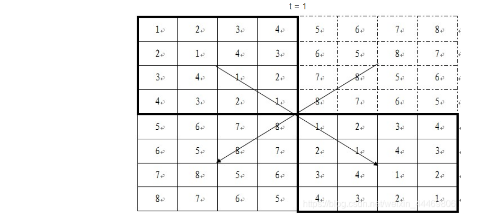
```c++
#include <iostream>
#include <vector>
using namespace std;

// 递归生成赛程表
void fillSchedule(vector<vector<int>>& table, int top, int left, int size) {
    // 基础情况：2x2赛程表
    if (size == 2) {
        table[top][left] = top + 1;
        table[top][left + 1] = top + 2;
        table[top + 1][left] = top + 2;
        table[top + 1][left + 1] = top + 1;
        return;
    }
    
    int half = size / 2;
    
    // 递归填充左上角
    fillSchedule(table, top, left, half);
    
    // 递归填充右上角
    fillSchedule(table, top, left + half, half);
    
    // 根据左上和右上填充下半部分
    for (int i = 0; i < half; i++) {
        for (int j = 0; j < half; j++) {
            // 左下 = 右上
            table[top + half + i][left + j] = table[top + i][left + half + j];
            
            // 右下 = 左上
            table[top + half + i][left + half + j] = table[top + i][left + j];
        }
    }
}

// 生成赛程表入口函数
void generateSchedule(vector<vector<int>>& table, int n) {
    // 递归填充整个表格
    fillSchedule(table, 0, 0, n);
}

// 打印赛程表
void printSchedule(const vector<vector<int>>& table) {
    int n = table.size();
    cout << "循环赛日程表 (选手\\比赛日):" << endl;
    cout << "     ";
    for (int day = 0; day < n; day++) {
        cout << "D" << day + 1 << "\t";
    }
    cout << endl;
    
    for (int player = 0; player < n; player++) {
        cout << "P" << player + 1 << ":\t";
        for (int day = 0; day < n; day++) {
            cout << "P" << table[player][day] << "\t";
        }
        cout << endl;
    }
}

int main() {
    int k = 3; // 3轮比赛 = 8位选手
    int n = 1 << k; // 选手数量
    
    vector<vector<int>> table(n, vector<int>(n));
    generateSchedule(table, n);
    printSchedule(table);
    
    return 0;
}
```
## .整数划分
### 问题描述
将正整数n表示成一系列的正整数之和，n=n1+n2+…+nk(n1>=n2>=…>=nk>=1,k>=1).正整数n的这种表示称为正整数n的划分。
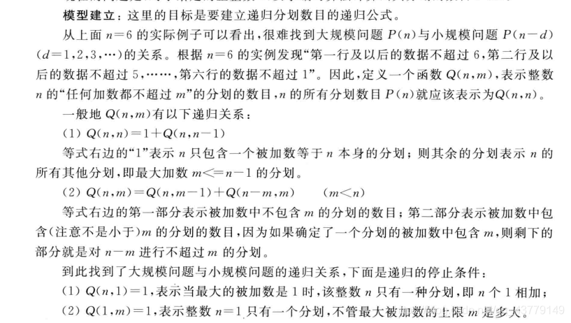
```c++
##include<iostream>
using namespace std;
/**
 * 计算整数n的划分数（将n表示为正整数之和的方法数）
 * @param n 待划分的整数
 * @param max 划分中允许的最大部分值
 * @return 划分数目
 */
int countPartitions(int n, int max) {
    // 基础情况处理
    // 当n小于1或max小于1时，无法划分，返回0
    if (n < 1 || max < 1) return 0;

    // 情况1：当n小于等于max时
    // 此时划分有两种选择：
    // 1. 包含n本身的划分（即{n}）
    // 2. 所有部分都小于n的划分（递归调用countPartitions(n, n-1)）
    if (n <= max)
        return 1 + countPartitions(n, n - 1);

    // 情况2：当n大于max时
    // 划分为两部分：
    // 1. 至少包含一个max的划分：剩余部分为n-max，且允许继续使用max（递归调用countPartitions(n-max, max)）
    // 2. 所有部分都小于max的划分：递归调用countPartitions(n, max-1)
    if (n > max)
        return countPartitions(n - max, max) + countPartitions(n, max - 1);
}

int main() {
    int n;
    printf("请输入一个正整数: ");
    cin >> n;

    // 初始调用时，允许的最大部分为n本身（即至少包含一个n的划分）
    printf("%d的划分数: %d\n", n, countPartitions(n, n));

    return 0;
}
```

## .整数因子分解
### 问题描述
大于1的正整数n可以分解为：n=x1 * x2 * … * xm。 例如，当n=12 时，共有8 种不同的分解式： 12=12； 12=6 * 2； 12=4 * 3； 12=3 * 4； 12=3 * 2 * 2； 12=2 * 6； 12=2 * 3 * 2； 12=2 * 2 * 3。 对于给定的正整数n，计算n共有多少种不同的分解式。

```c++
#include<iostream>
#include<vector>
using namespace std;

int partion(int n, int minfact) {
    if (n == 1) return 1;  // 终止条件：找到一种分解
    if (n < minfact) return 0;  // 无法继续分解

    int count = 0;
    for (int fact = minfact; fact < n; fact++) {  // 注意循环到n-1
        if (n % fact == 0) {
            count += partion(n / fact, fact);
        }
    }

    // 处理n本身作为因子的情况（仅当n >= minfact时）
    if (n >= minfact) {
        count++;
    }

    return count;
}

int main() {
    int n;
    cin >> n;
    cout << partion(n, 2) << endl;
    return 0;
}    

```


# 动态规划
动态规划其实就是，给定一个问题，我们把它拆成一个个子问题，直到子问题可以直接解决。然后呢，把子问题答案保存起来，以减少重复计算。再根据子问题答案反推，得出原问题解的一种方法。
**动态规划最核心的思想，就在于拆分子问题，记住过往，减少重复计算。**
## .矩阵连乘问题
### 问题描述
矩阵乘法满足结合律，但不同的结合顺序会导致不同的计算复杂度。例如，计算3个矩阵 \( A_{1} \times A_{2} \times A_{3} \) 的顺序有两种：  
- \( (A_1 \times A_2) \times A_3 \)  
- \( A_1 \times (A_2 \times A_3) \)  
若 \( A_1 \) 是 \( p \times q \) 矩阵，\( A_2 \) 是 \( q \times r \) 矩阵，\( A_3 \) 是 \( r \times s \) 矩阵，则两种顺序的乘法次数分别为：  
- \( pqr + prs \)  
- \( qrs + pqs \)  
两者的计算量可能差异显著。**矩阵连乘问题的核心是：给定矩阵序列的维度，找到最优结合顺序，使得总乘法次数最少。**
### 输入与输出
输入: 第一行输入一个n，代表有n个矩阵接下来n行，每行输入两个数a,b，代表每个矩阵的维度。0<n,a,b<100
输出：计算所有矩阵连乘的最小乘法次数，以及最优括号化方案


### 动态规划解决思想
#### 1. 动态规划的核心思路
- **状态定义**：定义二维数组 \( \text{dp}[i][j] \)，表示计算第 \( i \) 个矩阵到第 \( j \) 个矩阵（\( A_i \times A_{i+1} \times \dots \times A_j \)）的最小乘法次数，其中 \( 1 \leq i \leq j \leq n \)（假设矩阵从1开始编号）。  
- **初始状态**：当 \( i = j \) 时，只有一个矩阵，无需计算，故 \( \text{dp}[i][i] = 0 \)。  

#### 2. 状态转移方程
对于 \( i < j \)，假设在第 \( k \) 个矩阵处拆分序列（\( i \leq k < j \)），则总计算量为：  
\[
\text{dp}[i][j] = \min_{i \leq k < j} \left\{ \text{dp}[i][k] + \text{dp}[k+1][j] + d_{i-1} \times d_k \times d_j \right\}
\]  
- **解释**：  
  - \( \text{dp}[i][k] \) 是计算前半部分 \( A_i \times \dots \times A_k \) 的最小次数。  
  - \( \text{dp}[k+1][j] \) 是计算后半部分 \( A_{k+1} \times \dots \times A_j \) 的最小次数。  
  - \( d_{i-1} \times d_k \times d_j \) 是将两部分结果相乘的次数（前半部分结果的维度为 \( d_{i-1} \times d_k \)，后半部分为 \( d_k \times d_j \)）。  

#### 3. 计算顺序
- **按矩阵链长度递增计算**：先计算长度为2的矩阵链（相邻两个矩阵相乘），再计算长度为3的链，直到长度为 \( n \) 的链。  
- **示例**：若有 \( n \) 个矩阵，链长度 \( L = j - i + 1 \)，则计算顺序为：  
  - \( L = 2 \)：计算所有相邻两个矩阵的 \( \text{dp}[i][i+1] \)。  
  - \( L = 3 \)：计算 \( \text{dp}[i][i+2] \)，依此类推。  
  - 直到 \( L = n \)：计算 \( \text{dp}[1][n] \)，即最终结果。  

#### 4. 最优解追踪（可选）
若需要输出括号化方案，可额外定义二维数组 \( \text{split}[i][j] \)，记录使 \( \text{dp}[i][j] \) 取得最小值的拆分点 \( k \)。最终通过递归或迭代解析 \( \text{split} \) 数组，生成括号化表达式。

#### 5. 时间复杂度与空间复杂度
- **时间复杂度**：\( O(n^3) \)，其中 \( n \) 为矩阵个数。需遍历所有可能的链长度 \( L \)、起点 \( i \) 和拆分点 \( k \)。  
- **空间复杂度**：\( O(n^2) \)，用于存储 \( \text{dp} \) 和 \( \text{split} \) 数组（若不需要追踪括号化方案，可优化为 \( O(n) \)，但实现较复杂）。


### 三、示例推导
假设矩阵维度为 \( \text{dim} = [10, 20, 30, 40] \)（共3个矩阵：\( A_1(10 \times 20) \)，\( A_2(20 \times 30) \)，\( A_3(30 \times 40) \)）。  
1. **初始化**：\( \text{dp}[i][i] = 0 \)（\( i=1,2,3 \)）。  
2. **计算 \( L=2 \) 的情况**：  
   - \( \text{dp}[1][2] = 10 \times 20 \times 30 = 6000 \)  
   - \( \text{dp}[2][3] = 20 \times 30 \times 40 = 24000 \)  
3. **计算 \( L=3 \) 的情况**：  
   - 拆分点 \( k=1 \)：\( \text{dp}[1][1] + \text{dp}[2][3] + 10 \times 20 \times 40 = 0 + 24000 + 8000 = 32000 \)  
   - 拆分点 \( k=2 \)：\( \text{dp}[1][2] + \text{dp}[3][3] + 10 \times 30 \times 40 = 6000 + 0 + 12000 = 18000 \)  
   - 取最小值：\( \text{dp}[1][3] = 18000 \)，最优拆分点 \( k=2 \)，对应顺序为 \( A_1 \times (A_2 \times A_3) \)。


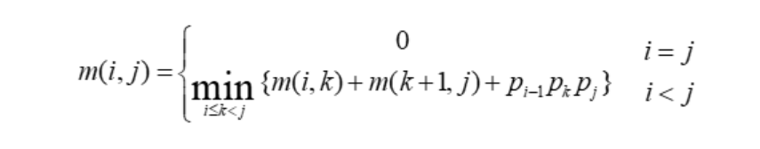
```c++
#include <iostream>
#include <vector>
#include <climits>
using namespace std;

int n; // 矩阵数量

/**
 * 计算矩阵连乘的最小代价并记录最优分割点
 * @param dims 矩阵维度数组，dims[i][0]和dims[i][1]分别表示第i个矩阵的行数和列数
 * @param split 记录最优分割点的二维数组
 * @return 最小乘法次数
 */
int matrixChainOrder(const vector<vector<int>>& dims, vector<vector<int>>& split) {
    // 创建DP表，dp[i][j]表示计算矩阵Ai到Aj的最小代价
    vector<vector<int>> dp(n, vector<int>(n, 0));

    // 按链长递增计算（从长度为2开始，因为长度为1的链不需要计算）
    for (int len = 2; len <= n; ++len) {
        // 遍历所有可能的起始位置i
        for (int i = 0; i <= n - len; ++i) {
            int j = i + len - 1; // 计算当前链的结束位置
            dp[i][j] = INT_MAX;  // 初始化为最大值，以便后续找到最小值

            // 尝试所有可能的分割点k（将链分为[i,k]和[k+1,j]两部分）
            for (int k = i; k < j; ++k) {
                // 计算代价：左子链代价 + 右子链代价 + 左右结果相乘的代价
                // dims[i][0]*dims[k][1]*dims[j][1]表示将两个子链结果相乘的乘法次数
                int cost = dp[i][k] + dp[k + 1][j] + dims[i][0] * dims[k][1] * dims[j][1];

                // 如果找到更小的代价，则更新DP表和分割点表
                if (cost < dp[i][j]) {
                    dp[i][j] = cost;
                    split[i][j] = k;
                }
            }
        }
    }
    
    // 返回计算所有矩阵连乘的最小代价
    return dp[0][n - 1];
}

/**
 * 递归打印最优括号结构
 * @param split 存储最优分割点的二维数组
 * @param i 当前链的起始矩阵索引
 * @param j 当前链的结束矩阵索引
 */
void printOptimalOrder(const vector<vector<int>>& split, int i, int j) {
    if (i == j) {
        // 基本情况：只有一个矩阵，直接输出
        cout << "A" << i + 1;
        return;
    }
    
    // 输出左括号
    cout << "(";
    
    // 递归打印左半部分的最优括号结构
    printOptimalOrder(split, i, split[i][j]);
    
    // 输出乘号
    cout << " x ";
    
    // 递归打印右半部分的最优括号结构
    printOptimalOrder(split, split[i][j] + 1, j);
    
    // 输出右括号
    cout << ")";
}

int main() {
    // 输入矩阵数量
    cin >> n;
    
    // 创建矩阵维度数组和分割点数组
    vector<vector<int>> dims(n, vector<int>(2));
    vector<vector<int>> split(n, vector<int>(n));

    // 输入每个矩阵的维度
    for (int i = 0; i < n; ++i) {
        cin >> dims[i][0] >> dims[i][1];
    }

    // 计算最小乘法次数
    int minCost = matrixChainOrder(dims, split);
    
    // 输出最小计算代价
    cout << "最小计算代价: " << minCost << endl;

    // 输出最优乘法顺序
    cout << "\n最优乘法顺序: ";
    printOptimalOrder(split, 0, n - 1);
    cout << endl;

    return 0;
}

```
## .01背包问题
有N件物品和一个最多能被重量为W 的背包。第i件物品的重量是weight[i]，得到的价值是value[i] 。每件物品只能用一次，求解将哪些物品装入背包里物品价值总和最大。
#### 1. 确定dp数组及其含义

-   **定义**：`dp[i][j]` 表示从下标为0到i的物品中选取物品放入容量为j的背包时的最大价值。
-   **含义**：`dp[i][j]` 是一个二维数组，其中 `i` 表示物品的索引，`j` 表示背包的容量。
  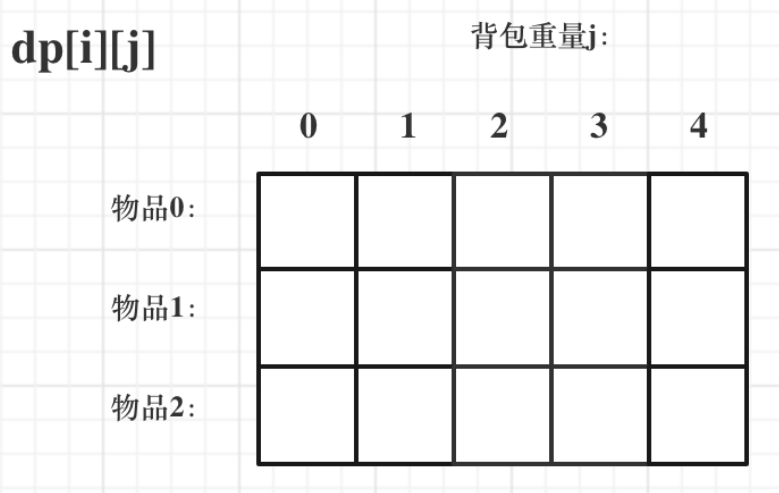

#### 2. 确定递推公式

-   **不选第i个物品**：`dp[i][j] = dp[i - 1][j]`，即不选第i个物品时，最大价值与前i-1个物品的最大价值相同。
-   **选第i个物品**：`dp[i][j] = dp[i - 1][j - w_i] + v_i`，即选第i个物品时，最大价值等于前i-1个物品在容量为 `j - w_i` 时的最大价值加上第i个物品的价值。
-   **递推公式**：`dp[i][j] = max(dp[i - 1][j], dp[i - 1][j - w_i] + v_i)`。

#### 3. 初始化dp数组

-   **初始化**：`dp[0][j]` 表示选第一个物品时的最大价值。
-   **边界条件**：当背包容量为0时，`dp[i][0] = 0`。

#### 4. 确定遍历顺序

-   **遍历物品**：外层循环遍历每个物品。
-   **遍历背包容量**：内层循环遍历背包容量，从大到小遍历以避免重复计算。

#### 5. 空间优化

-   **一维数组优化**：可以将二维数组优化为一维数组，通过从后向前遍历背包容量来更新 `dp` 数组。
```c++
#include<iostream>

int main() {
    int n, c; // n表示物品数量，c表示背包容量
    scanf("%d %d", &n, &c);

    // arr[i][0] 和 arr[i][1] 分别表示第i个物品的重量和价值
    int arr[n][2];
    for (int i = 0; i < n; i++) {
        scanf("%d %d", &arr[i][0], &arr[i][1]);
    }

    // dp[i][j] 表示前i个物品放入容量为j的背包中的最大价值
    int dp[n][c + 1];

    // 初始化：当背包容量为0时，最大价值为0
    for (int i = 0; i < n; i++) {
        dp[i][0] = 0;
    }

    // 初始化：第一个物品的情况
    for (int i = 0; i <= c; i++) {
        if (i < arr[0][0]) // 如果背包容量小于第一个物品的重量
            dp[0][i] = 0; // 无法放入，最大价值为0
        else
            dp[0][i] = arr[0][1]; // 背包容量足够，放入第一个物品
    }

    // 动态规划填充 dp 数组
    for (int i = 1; i < n; i++) { // 遍历每个物品（从第二个物品开始）
        for (int j = 0; j <= c; j++) { // 遍历背包容量
            if (j < arr[i][0]) // 如果背包容量不足以放入当前物品
                dp[i][j] = dp[i - 1][j]; // 继承上一个物品的状态
            else {
                // 计算放入当前物品后的价值
                int ne = dp[i - 1][j - arr[i][0]] + arr[i][1];
                // 取放入和不放入两种情况的最大值
                dp[i][j] = ne > dp[i - 1][j] ? ne : dp[i - 1][j];
            }
        }
    }

    // 输出结果：dp[n-1][c] 表示所有物品放入容量为c的背包的最大价值
    printf("%d", dp[n - 1][c]);

    return 0;
}
```

## .最长单调子序列
给定一个整数序列，找到其中最长的严格递增子序列（LIS）。子序列不一定是连续的，但必须保持原序列的顺序。

#### 1. 确定dp数组及其含义

-   **定义**：`dp[i]` 表示以第 `i` 个元素结尾的最长递增子序列的长度。
-   **含义**：`dp[i]` 是一个一维数组，其中 `i` 表示序列中元素的索引。

#### 2. 确定递推公式

-   **递推逻辑**：对于每个元素 `nums[i]`，遍历它之前的所有元素 `nums[j]`（`j < i`）。如果 `nums[i] > nums[j]`，则可以将 `nums[i]` 添加到以 `nums[j]` 结尾的递增子序列中，此时 `dp[i] = dp[j] + 1`。
-   **递推公式**：`dp[i] = max(dp[i], dp[j] + 1)`，其中 `j < i` 且 `nums[i] > nums[j]`。

#### 3. 初始化dp数组

-   **初始化**：每个元素本身可以看作一个长度为1的递增子序列，因此 `dp[i]` 初始值为1。

#### 4. 确定遍历顺序

-   **遍历顺序**：外层循环遍历每个元素，内层循环遍历当前元素之前的所有元素。

#### 5. 最终结果

-   **结果**：最长递增子序列的长度是 `dp` 数组中的最大值。
```c
#include <stdio.h>
#include <limits.h>

int longestIncreasingSubsequence(int nums[], int n) {
    if (n == 0) return 0; // 如果序列为空，返回0

    // dp[i] 表示以 nums[i] 结尾的最长递增子序列的长度
    int dp[n];
    for (int i = 0; i < n; i++) {
        dp[i] = 1; // 初始化：每个元素本身是一个长度为1的子序列
    }

    // 遍历每个元素
    for (int i = 1; i < n; i++) {
        // 遍历当前元素之前的所有元素
        for (int j = 0; j < i; j++) {
            // 如果当前元素大于前面的元素，则可以延长子序列
            if (nums[i] > nums[j]) {
                // 更新 dp[i] 为更大的值
                dp[i] = (dp[i] > dp[j] + 1) ? dp[i] : (dp[j] + 1);
            }
        }
    }

    // 找出 dp 数组中的最大值
    int maxLength = 0;
    for (int i = 0; i < n; i++) {
        if (dp[i] > maxLength) {
            maxLength = dp[i];
        }
    }

    return maxLength; // 返回最长递增子序列的长度
}

int main() {
    int nums[] = {10, 9, 2, 5, 3, 7, 101, 18}; // 示例序列
    int n = sizeof(nums) / sizeof(nums[0]); // 计算序列长度

    printf("最长递增子序列的长度是: %d\n", longestIncreasingSubsequence(nums, n));
    return 0;
}
```
```c++
#include <iostream>
#include <vector>
#include <algorithm>
using namespace std;

int main() {
    int n;
    cin >> n;
    vector<int> arr(n);
    for (int i = 0; i < n; i++) cin >> arr[i];

    vector<int> dp(n, 1), pre(n, -1);  // dp[i] = 以arr[i]结尾的LIS长度
    int maxLen = 0, endIdx = -1;        // 记录最长子序列的结束位置

    for (int i = 0; i < n; i++) {
        for (int j = 0; j < i; j++) {
            if (arr[i] > arr[j] && dp[j] + 1 > dp[i]) {
                dp[i] = dp[j] + 1;
                pre[i] = j;  // 记录转移来源
            }
        }
        if (dp[i] > maxLen) maxLen = dp[i], endIdx = i;
    }

    cout << maxLen << endl;
    vector<int> lis;
    for (int cur = endIdx; cur != -1; cur = pre[cur])
        lis.push_back(arr[cur]);
    reverse(lis.begin(), lis.end());  // 反转得到正序子序列

    for (int num : lis) cout << num << " ";
    return 0;
}
```

## .最长公共子序列
给定两个字符串 text1 和 text2，找到它们的最长公共子序列的长度。子序列不需要连续，但必须保持字符的相对顺序。

#### 1. 确定dp数组及其含义

-   **定义**：`dp[i][j]` 表示 `text1` 的前 `i` 个字符和 `text2` 的前 `j` 个字符的最长公共子序列的长度。
-   **含义**：`dp[i][j]` 是一个二维数组，其中 `i` 和 `j` 分别表示两个字符串的索引。
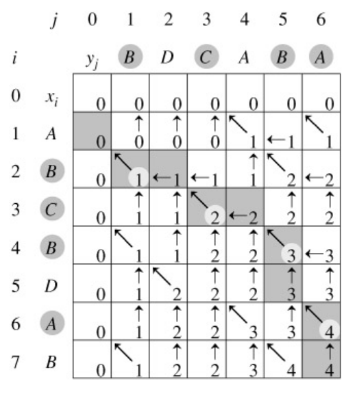

#### 2. 确定递推公式

-   **情况1**：如果 `text1[i-1] == text2[j-1]`，则 `dp[i][j] = dp[i-1][j-1] + 1`，因为可以将这个字符加入公共子序列。
-   **情况2**：如果 `text1[i-1] != text2[j-1]`，则 `dp[i][j] = max(dp[i-1][j], dp[i][j-1])`，即取两种情况下的最大值。

#### 3. 初始化dp数组

-   **初始化**：当 `i == 0` 或 `j == 0` 时，`dp[i][j] = 0`，因为空字符串与任何字符串的公共子序列长度为0。

#### 4. 确定遍历顺序

-   **遍历顺序**：外层循环遍历 `text1` 的每个字符，内层循环遍历 `text2` 的每个字符。

#### 5. 最终结果

-   **结果**：`dp[m][n]` 表示 `text1` 和 `text2` 的最长公共子序列的长度，其中 `m` 和 `n` 分别是 `text1` 和 `text2` 的长度。

```c
#include <stdio.h>
#include <string.h>

// 计算两个字符串的最长公共子序列长度
int longestCommonSubsequence(char *str1, char *str2) {
    int len1 = strlen(str1);  // 字符串1的长度
    int len2 = strlen(str2);  // 字符串2的长度
    
    // 创建DP表（多一行一列用于边界条件）
    int dp[len1 + 1][len2 + 1];  // dp[i][j] 表示str1前i个字符和str2前j个字符的LCS长度

    // 初始化边界：任一字符串为空时LCS长度为0
    for (int i = 0; i <= len1; i++) dp[i][0] = 0;
    for (int j = 0; j <= len2; j++) dp[0][j] = 0;

    // 填充DP表
    for (int i = 1; i <= len1; i++) {
        for (int j = 1; j <= len2; j++) {
            if (str1[i - 1] == str2[j - 1]) {
                // 当前字符匹配：长度 = 左上角值 + 1
                dp[i][j] = dp[i - 1][j - 1] + 1;
            } else {
                // 当前字符不匹配：取上方或左方的最大值
                int top = dp[i - 1][j];     // 上方单元格
                int left = dp[i][j - 1];     // 左方单元格
                dp[i][j] = (top > left) ? top : left;
            }
        }
    }

    return dp[len1][len2];  // 返回右下角的最终结果
}

int main() {
    char text1[] = "ABCBDAB";  // 测试字符串1
    char text2[] = "BDCAB";    // 测试字符串2

    int result = longestCommonSubsequence(text1, text2);
    printf("最长公共子序列的长度是: %d\n", result);
    
    return 0;
}
```

```c++
//注意:LCS不唯一
#include <iostream>
#include <vector>
#include <string>
using namespace std;

pair<int, string> longestCommonSubsequence(string text1, string text2) {
    int m = text1.length(), n = text2.length();
    
    // 创建 DP 表，dp[i][j] 表示 text1[0..i-1] 和 text2[0..j-1] 的 LCS 长度
    vector<vector<int>> dp(m + 1, vector<int>(n + 1, 0));
    
    // 填充 DP 表
    for (int i = 1; i <= m; i++) {
        for (int j = 1; j <= n; j++) {
            if (text1[i - 1] == text2[j - 1]) {
                dp[i][j] = dp[i - 1][j - 1] + 1;
            } else {
                dp[i][j] = max(dp[i - 1][j], dp[i][j - 1]);
            }
        }
    }
    
    // 回溯重建 LCS
    string lcs;
    int i = m, j = n;
    while (i > 0 && j > 0) {
        if (text1[i - 1] == text2[j - 1]) {
            lcs = text1[i - 1] + lcs;  // 添加到序列开头
            i--;
            j--;
        } else if (dp[i - 1][j] > dp[i][j - 1]) {
            i--;
        } else {
            j--;
        }
    }
    
    return {dp[m][n], lcs};  // 返回长度和序列本身
}

int main() {
    string text1 = "ABCBDAB";
    string text2 = "BDCAB";
    
    auto result = longestCommonSubsequence(text1, text2);
    cout << "最长公共子序列的长度: " << result.first << endl;
    cout << "最长公共子序列内容: " << result.second << endl;
    
    return 0;
}
```
## 爬楼梯问题
## 完全背包问题
## 硬币找零问题
## 最长递增子序列(LIS)
## 编辑距离
## 正则表达式匹配
## 最小路径和
  ### 问题描述
  **二维网格最小路径和**

    -   问题：给定一个 `m×n` 的网格，每个格子有一个权值，从左上角 `(0,0)` 走到右下角 `(m-1,n-1)`，每次只能向右或向下走，求路径权值和的最小值。

    -   示例：

        ```
        [[1,3,1],
         [1,5,1],
         [4,2,1]]
        ```
   
        最小路径和为 `1+3+1+1+1=7`（右→右→下→下→右 或 下→下→右→右→右等）。
### 状态转移方程
 **网格问题**：定义 `dp[i][j]` 表示从左上角走到 `(i,j)` 的最小路径和。
 `dp[i][j] = grid[i][j] + min(dp[i-1][j], dp[i][j-1])`  
    （当前位置的最小路径和 = 当前权值 + 上方或左方的最小路径和）。
####边界处理逻辑

    -   第一行（`i=0`）：只能从左边走来，`dp[0][j] = dp[0][j-1] + grid[0][j]`。
    -   第一列（`j=0`）：只能从上方走来，`dp[i][0] = dp[i-1][0] + grid[i][0]`。
#### 转移方向
每个内部点有 **2 个前驱**（上方和左方），移动方向固定为右或下。

```c++
#include <vector>
#include <algorithm>
using namespace std;

int minPathSum(vector<vector<int>>& grid) {
    if (grid.empty() || grid[0].empty()) return 0;
    
    int rows = grid.size();        // 网格行数
    int cols = grid[0].size();     // 网格列数
    
    // dp[i][j] 表示从左上角到 (i,j) 的最小路径和
    vector<vector<int>> dp(rows, vector<int>(cols, 0));
    
    // 初始化起点
    dp[0][0] = grid[0][0];
    
    // 初始化第一行（只能从左向右走）
    for (int col = 1; col < cols; ++col) {
        dp[0][col] = dp[0][col-1] + grid[0][col];
    }
    
    // 初始化第一列（只能从上向下走）
    for (int row = 1; row < rows; ++row) {
        dp[row][0] = dp[row-1][0] + grid[row][0];
    }
    
    // 动态规划填充剩余网格
    for (int row = 1; row < rows; ++row) {
        for (int col = 1; col < cols; ++col) {
            // 当前位置值 + 上方或左方的最小路径和
            dp[row][col] = grid[row][col] + min(dp[row-1][col], dp[row][col-1]);
        }
    }
    
    return dp[rows-1][cols-1];  // 返回到右下角的最小路径和
}
```
## 不同路径
## 三角形最小路径和
### 问题描述

  **三角形最小路径和**

    -   问题：给定一个三角形（每一行元素数依次递增），从顶部第一个元素出发，每次可以走到下一行的相邻元素（如第 `i` 行第 `j` 列元素可走到第 `i+1` 行的第 `j` 或 `j+1` 列），求到底部的最小路径和。
    -   示例：

        ```
        [
         [2],
         [3,4],
         [6,5,7],
         [4,1,8,3]
        ]
        ```

        最小路径和为 `2+3+5+1=11`。
### 状态转移方程
  **三角形问题**：定义 `dp[i][j]` 表示从顶部走到第 `i` 行第 `j` 列的最小路径和。
 `dp[i][j] = triangle[i][j] + min(dp[i-1][j-1], dp[i-1][j])`  
    （当前位置的最小路径和 = 当前权值 + 上一行同列或前一列的最小路径和）。
    
####边界处理逻辑
  -   第一行（`i=0`）：只有一个元素，`dp[0][0] = triangle[0][0]`。

    -   每行的首尾元素：

        -   首元素（`j=0`）：只能从上一行的首元素走来，`dp[i][0] = dp[i-1][0] + triangle[i][0]`。
        -   尾元素（`j=i`，第 `i` 行有 `i+1` 个元素）：只能从上一行的尾元素走来，`dp[i][i] = dp[i-1][i-1] + triangle[i][i]`。
#### 转移方向
每个内部点（非首尾）有 **2 个前驱**（上一行的同列和前一列），移动方向是到下一行的相邻列。
```c++
#include <vector>
#include <algorithm>
using namespace std;

int minimumTotal(vector<vector<int>>& triangle) {
    if (triangle.empty()) return 0;
    
    int levels = triangle.size();  // 三角形的层数
    vector<vector<int>> dp(levels, vector<int>(levels, 0));
    
    // 初始化顶部
    dp[0][0] = triangle[0][0];
    
    // 从第二层开始向下计算
    for (int level = 1; level < levels; ++level) {
        // 每层第一个元素：只能从正上方下来
        dp[level][0] = triangle[level][0] + dp[level-1][0];
        
        // 每层中间元素：取左上方和正上方的最小值
        for (int pos = 1; pos < level; ++pos) {
            dp[level][pos] = triangle[level][pos] + 
                             min(dp[level-1][pos-1], dp[level-1][pos]);
        }
        
        // 每层最后一个元素：只能从左上方下来
        dp[level][level] = triangle[level][level] + dp[level-1][level-1];
    }
    
    // 在底层寻找最小路径和
    return *min_element(dp[levels-1].begin(), dp[levels-1].end());
}
```


# 贪心算法
## 找零钱问题
### 问题描述
假设你开了间小店，不能电子支付，钱柜里的货币只有 25 分、10 分、5 分和 1 分四种硬币，如果你是售货员且要找给客户 41 分钱的硬币，如何安排才能找给客人的钱既正确且硬币的个数又最少？
### 算法思路
核心思想: 在每一步选择中，尽可能使用最大面额的硬币，以最小化硬币总数.
1. 前提条件
硬币面额必须满足“贪心选择性质”（如常见的十进制面额：1, 5, 10, 25等）。这意味着较大的面额是较小面额的整数倍，从而保证每一步选择最大面额硬币能得到全局最优解。
2. 算法步骤:
- 降序排序: 将硬币面额按从小到大排序.
- 贪心选择: 从最大面额开始,尽可能多地使用当前面额的硬币，直到剩余金额不足。
- 更新剩余金额: 用已选硬币的总值减去目标金额，得到新的剩余金额。
- 重复操作: 直到剩余金额为0.
```c
#include<iostream>
using namespace std;
int main(){
   int One=1;
   int Five=5;
   int Ten=10;
   int TwentyFive=25;
   int sum_money;
   cin>>sum_money;
   int num_25=0;
   int num_10=0;
   int num_5=0;
   int num_1=0;
   while(sum_money>=TwentyFive){
    num_25++;
    sum_money-=TwentyFive;
   } 
   while(sum_money>=Ten){
    num_10++;
    sum_money-=Ten;
   }
   while(sum_money>=Five){
    num_5++;
    sum_money-=Five;
   }
   while(sum_money>=One){
    num_1++;
    sum_money-=One;
   }
   cout<<num-25<<endl;
   cout<<num_10<<endl;
   cout<<num_5<<endl;
   cout<<num_1<<endl;
}
```
## 活动安排问题
### 问题描述
有n个活动申请使用同一个场所，每项活动有一个开始时间和一个截止时间，如果任何两个活动不能同时举行，问如何选择这些活动，从而使得被安排的活动数量达到最多？
设S = {1, 2, …, n}为活动的集合，si 和 fi 分别为活动i的开始和截止时间，i = 1, 2, …, n。定义活动i与j相容：si ≥ fj或sj ≥ fi, i ≠ j 求S最大的两两相容的活动子集，也即是尽可能地选择更多的会议来使用资源。
### 算法思路
1. 分析: 同一时间不能有两个活动同时发生，若（begin(1) , end(1)）区间与（begin(2) , end(2)）区间没有交集，则活动1与活动2是相容的。
2. 算法步骤
- 将所有活动按结束时间升序排列（即结束时间越早越靠前）。*为什么不按开始时间排序:选结束最早的活动，这样能留下更多时间给后面的活动。如果换成最早开始时间排序，可能会选一个开始早但结束晚的活动，导致后面很多活动无法安排。*
- 选择第一个活动（结束时间最早的活动），加入结果集。
- 遍历剩余活动:选择活动开始时间大于或等于结果集中最晚结束的时间加入结果集.
```C++
#include <iostream>
#include <algorithm>
using namespace std;

// 活动结构体，包含开始时间和结束时间
struct Activity {
    int start;
    int end;
};

// 比较函数：按结束时间升序排序
bool compareActivities(const Activity& a, const Activity& b) {
    return a.end < b.end;
}

// 使用标准库排序替代自定义快速排序
void sortActivities(Activity activities[], int n) {
    sort(activities, activities + n, compareActivities);
}

int main() {
    int n;
    cin >> n;
    
    Activity activities[n]; // 存储活动信息
    
    // 读取活动数据
    for(int i = 0; i < n; i++) {
        cin >> activities[i].start >> activities[i].end;
    }
    
    // 按结束时间排序
    sortActivities(activities, n);
    
    // 贪心算法选择最大活动数
    int count = 1; // 至少可以选择第一个活动
    int last_end = activities[0].end;
    
    for(int i = 1; i < n; i++) {
        // 如果当前活动的开始时间晚于上一个活动的结束时间
        if(activities[i].start >= last_end) {
            count++;
            last_end = activities[i].end;
        }
    }
    
    cout << "最多可以安排的活动数量: " << count << endl;
    return 0;
}
```
## 最优装载问题
### 问题描述
有一批集装箱要装上一艘载重量为 c 的轮船。其中集装箱i的重量为Wi 。最优装载问题要求确定在装载体积不受限制的情况下，将尽可能多的集装箱装上轮船。
### 算法思路
1. 核心思想: 先选择重量最轻的集装箱进行装载，以在总载重限制下实现最大装载数量。
2. 算法步骤:
-  将集装箱按重量从小到大排序，得到有序列表W
-  遍历W

## 会场安排问题
### 问题描述
假设要在足够多的会场里安排一批活动，并希望使用尽可能少的会场。设计一个有效的贪心算法进行安排。(这个问题实际上是著名的图着色问题。若将每一个活动作为图的一个顶点，不相容活动间用边相连。使相邻顶点着有不同颜色的最小着色数，相应于要找的最小会场数。)
### 算法思想
会场安排问题的最优解法基于**扫描线算法**（Sweep Line Algorithm），步骤如下：
1.  **分离时间点**：将所有活动的开始时间和结束时间分别存储在两个数组中。

1.  **排序**：分别对开始时间数组和结束时间数组进行排序。

1.  **扫描线遍历**：使用双指针遍历两个数组，统计当前需要的会场数量：

    -   遇到一个开始时间，会场数量加 1。
    -   遇到一个结束时间，会场数量减 1。

1.  **记录最大值**：在遍历过程中记录最大的会场需求数。
```C++
#include <iostream>
#include <algorithm> // 使用标准库排序
using namespace std;

int main() {
    int n;
    cin >> n; // 活动数量
    
    int start_times[n]; // 活动开始时间
    int end_times[n];   // 活动结束时间
    
    // 读取活动数据
    for (int i = 0; i < n; i++) {
        cin >> start_times[i] >> end_times[i];
    }
    
    // 使用标准库排序替代自定义快速排序
    sort(start_times, start_times + n);   // 按开始时间升序排序
    sort(end_times, end_times + n);       // 按结束时间升序排序
    
    int start_ptr = 0;    // 开始时间数组的指针
    int end_ptr = 0;      // 结束时间数组的指针
    int current_rooms = 0; // 当前使用的会议室数量
    int max_rooms = 0;    // 最大需要的会议室数量
    
    // 双指针遍历活动时间
    while (start_ptr < n) {
        // 当前活动开始时没有活动结束，需要新会议室
        if (start_times[start_ptr] < end_times[end_ptr]) {
            current_rooms++;
            start_ptr++;
            max_rooms = max(max_rooms, current_rooms);
        } 
        // 有活动结束，释放会议室
        else {
            current_rooms--;
            end_ptr++;
        }
    }
    
    cout << "所需最少会议室数量: " << max_rooms << endl;
    return 0;
}
```


## 删数问题
### 问题描述
有一个长度为n（n <= 240）的正整数，从中取出s（s < n）个数，使剩余的数保持原来的次序不变，求这个正整数经过删数之后最小是多少。
### 贪心策略
1.  每次删除第一个满足 `arr[i] > arr[i+1]` 的数字 `arr[i]`，即第一个下降点。这样可以确保剩余的数字尽可能小。

    -   **原理**：删除下降点 `arr[i]` 后，高位数字减小（如从 `4` 变为 `3`），使得整体数值更小。
```c++
#include <iostream>
#include <string>
#include <vector>
using namespace std;

int main() {
    string num; // 存储输入的数字字符串
    int remove_count; // 需要删除的数字个数
    cin >> num >> remove_count;
    
    // 特殊情况：如果删除所有数字或数字为空
    if (remove_count >= num.size()) {
        cout << "0";
        return 0;
    }
    
    vector<char> stack; // 使用栈结构存储最终结果
    
    // 遍历每个数字
    for (char digit : num) {
        // 当还能删除数字，且栈顶数字大于当前数字时，删除栈顶数字
        while (remove_count > 0 && !stack.empty() && stack.back() > digit) {
            stack.pop_back();
            remove_count--;
        }
        stack.push_back(digit);
    }
    
    // 如果还有需要删除的数字，从尾部删除（因为剩余数字是升序排列）
    while (remove_count-- > 0) {
        stack.pop_back();
    }
    
    // 处理前导零
    int start_index = 0;
    while (start_index < stack.size() && stack[start_index] == '0') {
        start_index++;
    }
    
    // 输出结果
    if (start_index == stack.size()) {
        cout << "0";
    } else {
        for (int i = start_index; i < stack.size(); i++) {
            cout << stack[i];
        }
    }
    
    return 0;
}
```
## 背包问题
### 题目描述
有一个背包，背包容量是M=150。有7个物品，物品可以分割成任意大小。
要求尽可能让装入背包中的物品总价值最大，但不能超过总容量。
#### 1. **算法核心思想**

每一步选择当前 “性价比” 最高的物品（即单位重量价值最高），尽可能多地装入背包，直到装满。 **局部最优策略**：优先选择价值密度（\(v_i / w_i\)）高的物品，确保每单位重量贡献的价值最大。

#### 2. **具体步骤**

1.  计算每个物品的价值密度 \(v_i / w_i\)。
1.  按价值密度从高到低排序物品。
1.  依次遍历物品，若剩余容量足够，则装入整个物品；若剩余容量不足，则装入物品的一部分（分数）。
1.  直到背包装满或所有物品处理完毕。

```c++
#include <iostream>
#include <algorithm> // 使用标准库排序
#include <vector>    // 使用向量存储物品
using namespace std;

// 物品结构体，包含重量、价值和单位价值
struct Item {
    float weight;
    float value;
    float value_per_unit; // 单位重量的价值
    
    // 构造函数，初始化时计算单位价值
    Item(float w, float v) : weight(w), value(v), value_per_unit(v/w) {}
};

// 比较函数：按单位价值降序排序
bool compareItems(const Item& a, const Item& b) {
    return a.value_per_unit > b.value_per_unit;
}

int main() {
    int n; // 物品数量
    float capacity; // 背包容量
    cin >> n >> capacity;
    
    vector<Item> items;
    
    // 输入物品信息
    for (int i = 0; i < n; i++) {
        float weight, value;
        cin >> weight >> value;
        items.push_back(Item(weight, value));
    }
    
    // 按单位价值降序排序
    sort(items.begin(), items.end(), compareItems);
    
    vector<float> fractions(n, 0.0); // 存储每个物品的装入比例
    float remaining = capacity;      // 剩余背包容量
    
    // 贪心算法选择物品
    for (int i = 0; i < n && remaining > 0; i++) {
        if (remaining >= items[i].weight) {
            // 可以完整装入当前物品
            fractions[i] = 1.0;
            remaining -= items[i].weight;
        } else {
            // 装入部分当前物品
            fractions[i] = remaining / items[i].weight;
            remaining = 0; // 背包已满
        }
    }
    
    // 输出结果
    cout << "\n最优装入方案：" << endl;
    for (int i = 0; i < n; i++) {
        cout << "重量: " << items[i].weight 
             << ", 价值: " << items[i].value 
             << ", 装入比例: " << fractions[i] << endl;
    }
    
    return 0;
}
```
## 重构字符串
## 跳跃游戏I
## 分发饼干
## 买卖股票的最佳时机II
## Dijkstra算法
## Prim/Kruskal算法
## 霍夫曼编码
## 加油站问题


# 回溯算法
回溯算法（backtracking algorithm）是一种通过穷举来解决问题的方法，它的核心思想是从一个初始状态出发，暴力搜索所有可能的解决方案，当遇到正确的解则将其记录，直到找到解或者尝试了所有可能的选择都无法找到解为止。回溯算法通常采用“深度优先搜索”来遍历解空间
- 尝试与回退:  之所以称之为回溯算法，是因为该算法在搜索解空间时会采用“尝试”与“回退”的策略。当算法在搜索过程中遇到某个状态无法继续前进或无法得到满足条件的解时，它会撤销上一步的选择，退回到之前的状态，并尝试其他可能的选择。
- 剪枝: 复杂的回溯问题通常包含一个或多个约束条件，约束条件通常可用于“剪枝”。


## 回溯算法模板
```
void backtracking(参数) {
    if(终止条件) {
        存放结果;
        return;
    }
    for(选择: 本集合中元素 (树中结点孩子的数量就是集合的大小)) {
        处理节点;
        backtracking(路径,选择列表); // 递归
        回溯,撤销处理结果
    }
}

```
### 组合问题
#### 问题描述
给定两个整数 n 和 k，返回 1 ... n 中所有可能的 k 个数的组合。
示例:
输⼊: n = 4, k = 2
输出:
 [
  [2,4],
  [3,4],
  [2,3],
  [1,2],
  [1,3],
  [1,4]
 ]
 ##### 算法思路
 可将组合问题抽象为如下树形结构:
  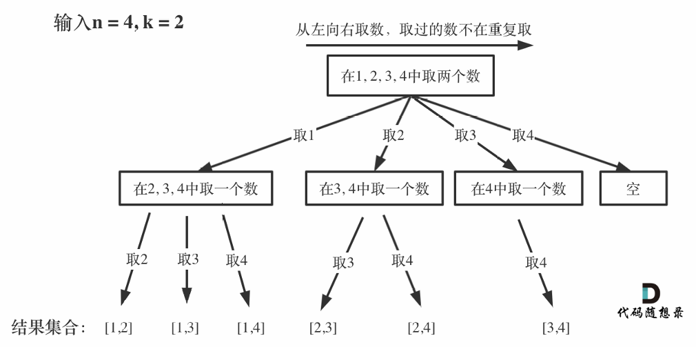
回溯法的搜索过程就是⼀个树型结构的遍历过程，for循环⽤来横向遍历，递归的过程是纵向遍历。
1. 算法步骤
- 初始化: 定义结果列表和回溯函数
- 递归终止条件: 当前路径长度等于k时,保存结果
- 遍历元素: 从起始索引开始遍历
- 剪枝优化: 如果剩余元素不足以填满组合,提前终止循环
- 递归与回溯: . 选择当前元素加入路径, 递归处理下一个位置,撤销选择,回溯到上一步.
```c++
#include<iostream>
#include<vector>
using namespace std;
vector<vector<int>> result;  // 存储所有组合的结果集

// 回溯函数：从start到n中选择k个数字的所有组合
// start: 当前可选择的起始数字
// n: 可选数字的最大值
// k: 还需要选择的数字个数
// current: 当前已选择的数字组合
void backtracking(int start, int n, int k, vector<int>& current) {
    // 当已选择的数字个数达到k时，将当前组合加入结果集
    if (current.size() == k) {
        result.push_back(current);
        return;
    }
    
    // 计算剩余需要选择的数字个数，用于剪枝优化
    int remain = k - current.size();
    
    // 剪枝条件：i的最大值为n-remain+1，确保剩余数字足够选择
    // 例如：n=4, k=2, 当前组合为[1]，则i最大为3（若i=4则无法选第二个数）
    for (int i = start; i <= n - remain + 1; i++) {
        current.push_back(i);             // 选择当前数字i
        backtracking(i + 1, n, k, current); // 递归选择后续数字
        current.pop_back();               // 回溯：撤销选择，尝试其他可能
    }
}

int main() {
    int n, k;
    cin >> n >> k;                // 输入n和k
    vector<int> current;          // 存储当前组合
    backtracking(1, n, k, current); // 从1开始回溯生成组合
    
    // 输出所有组合，每个组合占一行
    for (auto& re : result) {     // 使用引用避免拷贝，提高性能
        for (int num : re) {
            cout << num << " ";
        }
        cout << endl;
    }
    return 0;
}
```
### 子集
给定⼀组不含重复元素的整数数组 nums，返回该数组所有可能的⼦集（幂集）。
说明：解集不能包含重复的⼦集。
示例:
输⼊: nums = [1,2,3]
输出:
 [
  [3],
 [1],
 [2],
 [1,2,3],
 [1,3],
 [2,3],
 [1,2],
 []
 ]
 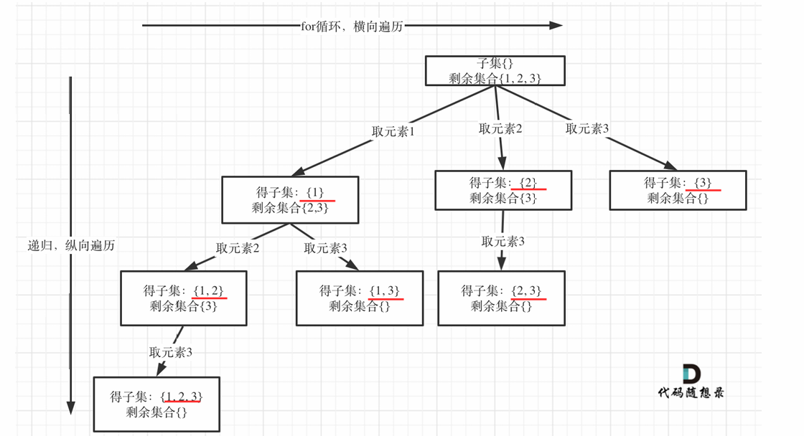
 如果把 ⼦集问题、组合问题、分割问题都抽象为⼀棵树的话，那么组合问题和分割问题都是收集树的叶⼦节点，⽽
⼦集问题是找树的所有节点！
其实⼦集也是⼀种组合问题，因为它的集合是⽆序的，⼦集{1,2} 和 ⼦集{2,1}是⼀样的。
那么既然是⽆序，取过的元素不会重复取，写回溯算法的时候，for就要从startIndex开始，⽽不是从0开始！
```c++
#include<iostream>
#include<vector>
using namespace std;
vector<vector<int>> result;  // 存储所有子集的结果集

// 回溯函数：生成从start位置开始的所有子集
// nums: 原始输入数组
// start: 当前处理的起始位置
// current: 当前已选择的元素组合
void backtracking(vector<int>& nums, int start, vector<int>& current) {
    // 每次进入函数时，当前组合即为一个子集，加入结果集
    // 包括空集和不同长度的子集
    result.push_back(current);
    
    // 从start开始遍历，避免重复选择元素
    for (int i = start; i < nums.size(); i++) {
        current.push_back(nums[i]);        // 选择当前元素
        backtracking(nums, i + 1, current); // 递归生成以i+1开始的子集
        current.pop_back();                // 回溯：撤销选择，尝试其他可能
    }
}

int main() {
    int n;
    cin >> n;                        // 输入数组长度
    vector<int> nums(n);             // 初始化数组
    
    // 读取数组元素
    for (int i = 0; i < n; i++) {
        cin >> nums[i];
    }
    
    vector<int> current;             // 存储当前子集
    backtracking(nums, 0, current);  // 从位置0开始生成所有子集
    
    // 格式化输出所有子集
    for (auto& re : result) {
        cout << "[";
        for (int i = 0; i < re.size(); i++) {
            cout << re[i];
            if (i < re.size() - 1) {
                cout << ",";
            }
        }
        cout << "]" << endl;
    }
    return 0;
}
```


### N皇后
#### 问题描述
n 皇后问题 研究的是如何将 n 个皇后放置在 n×n 的棋盘上，并且使皇后彼此之间不能相互攻击。
给你⼀个整数n，返回所有不同的n皇后问题的解决⽅案
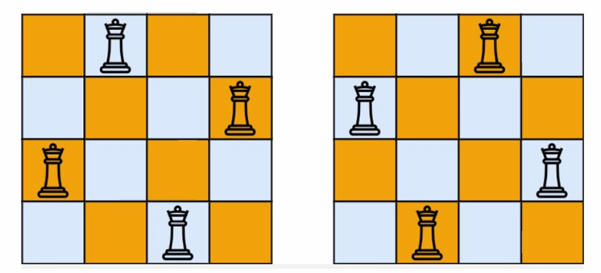
输⼊：n = 4
输出：[[".Q..","...Q","Q...","..Q."],["..Q.","Q...","...Q",".Q.."]\]
解释：如上图所示，4 皇后问题存在两个不同的解法法包含⼀个不同的 n 皇后问题 的棋⼦放置⽅案，该⽅案中 'Q' 和 '.' 分别代表了皇后和空位。
#### 算法思路
1. 约束条件:
- 不能同⾏
- 不能同列
- 不能同斜线
将搜索过程抽象为⼀棵树，如图:
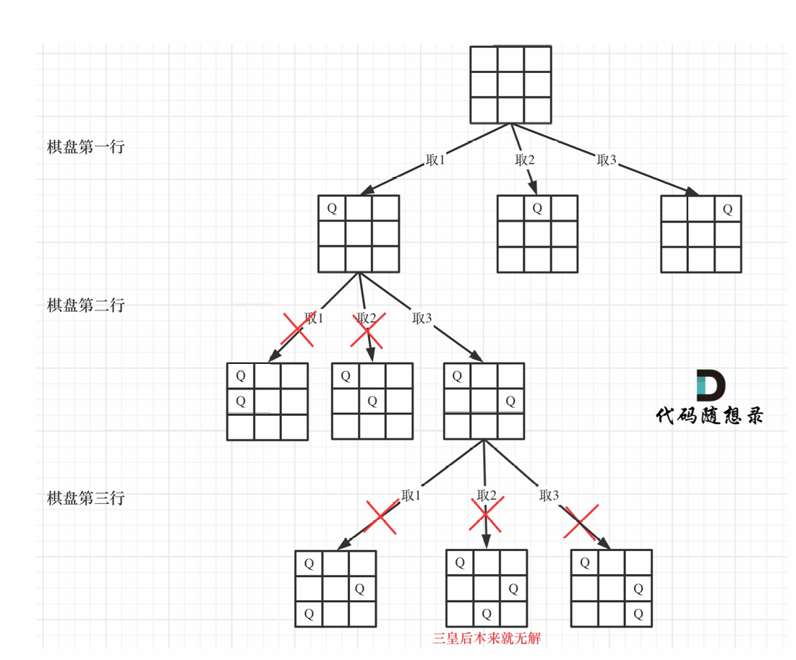;
2. 核心思想
通过递归逐行放置皇后，每次尝试在当前行的某一列放置皇后，并通过剪枝跳过无效位置。具体步骤如下：
-   **选择**：在当前行的每一列尝试放置皇后。
-   **约束**：检查当前列和两个对角线是否已被占用。
-   **目标**：成功放置N个皇后时记录解。
-   **回溯**：撤销当前行的选择，尝试其他列。


3. 算法步骤
-  **初始化**：定义列、主对角线、副对角线的状态数组。
-  **递归终止条件**：所有皇后已放置（`row == N`），保存当前解。
-  **遍历列位置**：对当前行的每一列进行尝试。
-  **冲突检查**：
    -   若当前列或对角线已被占用，跳过。
    -   否则标记当前列和对角线为已占用。
-  **递归**：处理下一行的皇后放置。
-  **回溯**：撤销当前列和对角线的占用状态。
```c++
#include<iostream>
#include<vector>
#include<string>
using namespace std;
vector<vector<string>> result;  // 存储所有可行的棋盘布局

// 检查在(row, col)位置放置皇后是否安全
// 需确保当前列、左上对角线、右上对角线无其他皇后
bool isSafe(int row, int col, vector<string>& board) {
    int n = board.size();
    // 检查当前列上方是否有皇后
    for (int i = 0; i < row; i++) {
        if (board[i][col] == 'Q')
            return false;
    }
    // 检查左上对角线是否有皇后
    for (int i = row - 1, j = col - 1; i >= 0 && j >= 0; i--, j--) {
        if (board[i][j] == 'Q') return false;
    }
    // 检查右上对角线是否有皇后
    for (int i = row - 1, j = col + 1; i >= 0 && j < n; i--, j++) {
        if (board[i][j] == 'Q') return false;
    }
    return true;
}

// 回溯函数：在第row行放置皇后
// n: 棋盘大小
// row: 当前处理的行索引
// board: 当前棋盘状态
void backtracking(int n, int row, vector<string>& board) {
    // 所有行处理完毕，保存当前棋盘布局
    if (row == n) {
        result.push_back(board);
        return;
    }
    // 尝试在当前行的每一列放置皇后
    for (int col = 0; col < n; col++) {
        if (isSafe(row, col, board)) {
            board[row][col] = 'Q';  // 放置皇后
            backtracking(n, row + 1, board);  // 递归处理下一行
            board[row][col] = '.';  // 回溯：撤销当前放置
        }
    }
}

int main() {
    int n;
    cin >> n;  // 输入棋盘大小
    vector<string> board(n, string(n, '.'));  // 初始化n×n棋盘，全为'.'

    backtracking(n, 0, board);  // 从第0行开始回溯求解
    
    // 输出所有可行解
    for (auto& sol : result) {
        for (string& row : sol) {
            cout << row << endl;
        }
        cout << endl;  // 解之间用空行分隔
    }
    return 0;
}
```
# TSP
## 问题描述
输入：城市数量 n，距离矩阵 dist[n][n]（dist[i][j] 表示城市 i 到 j 的距离）。
目标：从起点（通常为城市 0）出发，访问每个城市恰好一次后返回起点，求最小总距离。
##算法思想
回溯法求解旅行商问题（TSP）的核心思路是系统地搜索所有可能的路径排列，利用剪枝策略避免无效搜索，并在搜索过程中记录和更新当前最优解。
#### 1. **状态表示**

-   **当前路径**：用数组或列表记录已访问的城市顺序，例如`path[]`，其中`path[i]`表示第 i 步访问的城市。
-   **已访问标记**：用布尔数组`visited[]`记录城市是否已访问。
-   **当前路径长度**：记录从起点到当前城市的总距离`currentDist`，用于剪枝。
-   **最优解**：记录最短路径`bestPath`和最短距离`minDist`。

#### 2. **递归搜索过程**

-   **起点选择**：通常固定起点（如城市 0），避免重复计算对称路径（如 0→1→2→0 和 0→2→1→0 视为不同路径，但起点固定后可减少搜索空间）。
-   **递归扩展**：从当前城市出发，遍历所有未访问的城市，将其加入路径，递归搜索下一个城市。
-   **终止条件**：当所有城市都被访问后，返回起点，计算完整路径的总距离，并更新最优解。

#### 3. **剪枝策略**

-   **距离剪枝**：若当前路径长度`currentDist`已超过当前最优解`minDist`，则回溯（提前终止当前分支的搜索）。
-   **最优性剪枝**：在搜索过程中，若剩余未访问城市的最短可能距离之和加上当前距离已超过`minDist`，则回溯。

```c++
#include<iostream>
#include<vector>
#include<climits>
using namespace std;
vector<int> bestPath;
int n;
int minCost = INT_MAX;

void backtracking(int current, int depth, int cost, vector<vector<int>>& distance, vector<bool>& visited, vector<int>& path) {
    if (depth == n) {
        // 检查能否从最后一个城市回到起点
        if (distance[current][0] > 0) {  // 增加起点可达性检查
            int totalCost = cost + distance[current][0];
            if (totalCost < minCost) {
                minCost = totalCost;
                bestPath = path;
            }
        }
        return;
    }
    for (int next = 0; next < n; next++) {
        // 增加不可达边检查：距离必须大于0
        if (!visited[next] && distance[current][next] > 0) {
            int newCost = cost + distance[current][next];
            if (newCost >= minCost) continue;  // 剪枝
            visited[next] = true;
            path[depth] = next;
            backtracking(next, depth + 1, newCost, distance, visited, path);
            visited[next] = false;
        }
    }
}

int main() {
    cin >> n;
    vector<vector<int>> distance(n, vector<int>(n));
    for (int i = 0; i < n; i++) {
        for (int j = 0; j < n; j++) {
            cin >> distance[i][j];
        }
    }
    vector<bool> visited(n, false);
    vector<int> path(n);
    
    visited[0] = true;
    path[0] = 0;
    backtracking(0, 1, 0, distance, visited, path);
    
    cout << minCost << endl;
    cout << "0";
    for (int i = 1; i < n; i++) {
        cout << "->" << bestPath[i];
    }
    cout << "->0" << endl;
    return 0;
}
```
# 01背包问题
```c++
#include <iostream>
#include <vector>
#include <climits>
using namespace std;

// 使用深度优先搜索求解0-1背包问题
void knapsackDFS(int itemIndex, int currentWeight, int currentValue, 
                const vector<int>& weights, const vector<int>& values,
                int capacity, int& maxValue) {
    // 超出背包容量，直接返回
    if (currentWeight > capacity) return;
    
    // 处理完所有物品，更新最大价值
    if (itemIndex == weights.size()) {
        if (currentValue > maxValue) 
            maxValue = currentValue;
        return;
    }
    
    // 不选当前物品
    knapsackDFS(itemIndex + 1, currentWeight, currentValue, 
               weights, values, capacity, maxValue);
    
    // 选当前物品
    knapsackDFS(itemIndex + 1, currentWeight + weights[itemIndex], 
               currentValue + values[itemIndex], 
               weights, values, capacity, maxValue);
}

int main() {
    int n, capacity;
    cout << "输入物品数量: ";
    cin >> n;
    cout << "输入背包容量: ";
    cin >> capacity;
    
    vector<int> weights(n), values(n);
    
    cout << "输入物品重量: ";
    for (int i = 0; i < n; i++)
        cin >> weights[i];
    
    cout << "输入物品价值: ";
    for (int i = 0; i < n; i++)
        cin >> values[i];
    
    int maxValue = INT_MIN;
    knapsackDFS(0, 0, 0, weights, values, capacity, maxValue);
    
    cout << "背包能装的最大价值: " << maxValue << endl;
    
    return 0;
}
```
## 分割回文串
## 单词搜索
## 分割等和子集
## 递增子序列
