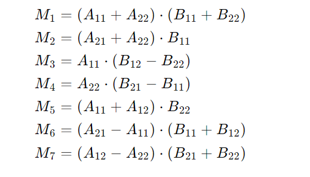

# 递归
## 1，排列问题
基本思想：
1. 在每一步选择一个数字，并递归处理剩下的数字。
2. 当递归到最底层时，记录当前的排列。
3. 回溯到上一层，继续选择其他可能的数字。
```
#include <stdio.h>

// 交换两个整数的值的函数
void Swap(int *a, int *b) {
    int temp = *a;
    *a = *b;
    *b = temp;
}

// 递归生成数组 list 从索引 k 到 m 的全排列
void Perm(int list[], int k, int m) {
    // 当 k 等于 m 时，意味着已经完成了一个排列的构建
    if (k == m) {
        // 遍历数组，输出当前排列的每个元素
        for (int i = 0; i <= m; i++) {
            printf("%d ", list[i]);
        }
        // 输出换行符，为下一个排列的输出做准备
        printf("\n");
    }
    // 尝试将从索引 k 到 m 的每个元素放到当前排列的第 k 个位置
    for (int i = k; i <= m; i++) {
        // 交换 list[k] 和 list[i] 的值，将 list[i] 放到当前排列的第 k 个位置
        Swap(&list[k], &list[i]);
        // 递归调用 Perm 函数，继续生成从索引 k + 1 到 m 的全排列
        Perm(list, k + 1, m);
        // 回溯操作，将 list[k] 和 list[i] 交换回来，恢复数组原来的顺序
        // 以便尝试下一个可能的排列
        Swap(&list[k], &list[i]);
    }
}
```
## 2. 汉诺塔Hanoi问题
基本思路: 
- 当只有一个圆盘时，直接将其从 A 柱移动到 C 柱。
- 当有 n 个圆盘时，可以把问题分解为三个步骤：
  - 先将 A 柱上的 n - 1 个圆盘借助 C 柱移动到 B 柱。
  - 然后把 A 柱上剩下的一个圆盘（即最大的圆盘）直接移动到 C 柱。
  - 最后再将 B 柱上的 n - 1 个圆盘借助 A 柱移动到 C 柱。


# 分治
-   **分解**：将原问题分解为若干个子问题，子问题的规模尽量相等，且子问题的结构与原问题相同。
-   **解决**：递归地求解每个子问题。如果子问题的规模足够小，则直接求解。
-   **合并**：将子问题的解合并成原问题的解。
## 1. 二分搜索
基本思想：
正常二分将一个完整的区间分成两个区间，两个区间本应单独找值然后确认结果，但是通过有序的区间可以直接确定结果在那个区间，所以分的两个区间只需要计算其中一个区间，然后继续进行一直到结束。
```c
int binarySearch(int nums[], int target,int n){
    int left=0,right=n-1;
    while(left<right) {
        int mid=(left+right)/2;
        if(nums[mid] == target) return mid;
        else if(nums[mid]>target) right=mid-1;
        else left=mid+1;
    }
    return -1;
}
```
## 2. 快速排序
基本思想：
通过选择一个基准值，将待排序数组分为两部分，使得左边部分的元素都小于等于基准值，右边部分的元素都大于等于基准值，然后递归地对左右两部分进行排序，最终使整个数组有序。
算法步骤：
1.  **选择基准值**：从数组中选择一个元素作为基准值（通常选择第一个元素、最后一个元素或中间元素等）。

2.  **划分操作**：使用双指针法，从数组的两端开始向中间扫描。设置两个指针，一个指向数组的起始位置（`left`），一个指向数组的末尾位置（`right`）。

    -   首先，从右向左移动 `right` 指针，找到第一个小于基准值的元素。
    -   然后，从左向右移动 `left` 指针，找到第一个大于基准值的元素。
    -   交换 `left` 和 `right` 指向的元素。
    -   重复上述步骤，直到 `left` 和 `right` 相遇。此时，基准值左边的元素都小于等于基准值，右边的元素都大于等于基准值。

3.  **递归排序**：将数组分为基准值左边和右边两部分，递归地对这两部分重复上述步骤，直到子数组的长度为 1 或 0，此时数组已经完全有序。
```c

void quickSort(int a[], int left, int right) {
    int low = left;
    int high = right;  // 这里原代码拼写错误，是high不是hight
    if (low > high) {
        return;
    }
    int k = a[low];
    while (low < high) {
        while (low < high && a[high] >= k) {
            high--;
        }
        a[low] = a[high];
        while (low < high && a[low] <= k) {
            low++;
        }
        a[high] = a[low];
    }
    a[low] = k;
    quickSort(a, left, low - 1);
    quickSort(a, low + 1, right);
}
```
## 3. 归并排序
算法步骤：
1.  **分解阶段**

    -   找出数组的中间位置，把数组分成左右两部分。
    -   递归地对左右两部分子数组执行分解操作，直至子数组只有一个元素。

1.  **合并阶段**

    -   创建一个临时数组用于存放合并后的结果。
    -   比较左右两个子数组的元素，依次把较小的元素放入临时数组。
    -   若某个子数组的元素全部放入临时数组后，另一个子数组还有剩余元素，就把这些剩余元素直接复制到临时数组的末尾。
    -   把临时数组中的元素复制回原数组的对应位置。
```
void mergeSort(int arr[],int left,int right){
    int mid=(left+right)/2;
    if(left<right){
        mergeSort(arr,left,mid);
        mergeSort(arr,mid+1,right);
        merge(arr,left,mid,right);
    }
}

void merge(int arr[],int left,int mid,int right){
    int l=left,r=mid+1;
    int tem[right-left];
    int t=0;
    while(l<=mid&&r<=right){
        if(arr[l]<=arr[r]){
            tem[t++]=arr[l++];
        }
        else{
            tem[t++]=arr[r++];
        }
    }
    while(l<=mid){
        tem[t++]=arr[l++];
    }
    while(r<=right){
        tem[t++]=arr[r++];
    }
    for(int i=0;i<t;i++){
        arr[i]=tem[i];
    }
}
```
## 4. 最大子序列和
最大子序列和问题是指在一个整数序列中，找出一个连续的子序列，使得该子序列中所有元素的和最大。
分治算法思想：
将原序列从中间分成左右两部分，那么最大子序列和可能出现在以下三种情况中：

1.  **完全位于左半部分**：最大子序列完全在原序列的左半部分。
1.  **完全位于右半部分**：最大子序列完全在原序列的右半部分。
1.  **跨越中间位置**：最大子序列跨越了原序列的中间位置，一部分在左半部分，一部分在右半部分。

分别递归地求解左半部分和右半部分的最大子序列和，再单独计算跨越中间位置的最大子序列和，最后取这三个结果中的最大值作为原问题的解。
```c
int maxsub(int arr[],int left,int right){
    if(left==right){
        return arr[left];
    }
    int mid=(left+right)/2;
    int leftmax=maxsub(arr,left,mid);
    int rightmax=maxsub(arr,mid+1,right);

    int midleft=arr[mid];
    int midright=arr[mid+1];
    int team=0;
    for(int i=mid;i>=left;i--){
        team+=arr[i];
        if(team>midleft)
          midleft=team;
    }
    team=0;
    for(int i=mid+1;i<=right;i++){
        team+=arr[i];
        if(team>midright)
          midright=team;
    }
    int max=midleft+midright;
    if(max<leftmax)
      max=leftmax;
    if(max<rightmax)
      max=rightmax;
    return max;
}
```
动态规划解法：
动态规划递推方程：

 最大子数组的起始位置rec[] 的方程：

其实可以简单地理解成我们在当前的状态下**是否抛弃前面部分的最大累加和**。  
当我们前半部分最大累加和 ***dp[i-1]** * 是一个正数，那么我们当前元素 ***arr[i]** * 加上它，就是当前以 ***i*** 为结尾的最大累加和，此时就是 ***dp[i] = arr[i] + dp[i - 1]** *；  
当我们前半部分最大累加和 ***dp[i-1]** * 都已经是一个负值(或者0)了，那么我们当前元素 ***arr[i]** * 加上它只会让当前以 ***i*** 为结尾的最大累加和更小，所以我们要丢弃它，从新的起点下标开始，也就是此时的 ***dp[i] = arr[i]** *。
```c
void  Find_SubArray_Max(int arr[],int n){
    if(n==0)
     return 0;
    int dp[n];
    int rec[n];
    dp[0]=arr[0];
    rec[0]=0;
    for(int i=1;i<n;i++)
    {
        if(dp[i-1]>0){
            dp[i]=arr[i]+dp[i-1];
            rec[i]=rec[i-1];
        }else{
            dp[i]=a[i];
            rec[i]=i;
        }
    }
    int max=-99;
    int left,right;
    for(int i=0;i<n;i++){
        if(max<dp[i]){
            max=dp[i];
            left=rec[i];
            right=i;
        }
    }

    printf("sum_max:%d start:%d end:%d",max,left,right);
}
```
## 5. 大整数乘法
设有两个大整数X,Y; 是n位十进制整数，分段表示如下:

则可以得到：

进一步优化得：

分治递归具体步骤：
1.  **基例**：如果 x 和 y 的长度足够小（例如长度为 1），直接返回它们的乘积。

1.  **分解**：将 x 和 y 分解为 a,b,c,d。

1.  **递归计算**：

    -   计算 a⋅c
    -   计算 b⋅d
    -   计算 (a-b)⋅(c-d)

1.  **组合结果**：
    -   x⋅y=a⋅c⋅10^n^+[(a-b)⋅(c-d)+a⋅c+b⋅d]⋅10^n/2^+b⋅d

## 6. Strassen矩阵乘法
 **算法步骤**

1.  **矩阵分块**  
    将两个矩阵 A 和 B 分解为四个子矩阵：

  $
  A=
 \begin{bmatrix}
 A11&A12\\
 A21&A22\\
 \end{bmatrix}  
 B=
 \begin{bmatrix}
 B11&B12\\
 B21&B22\\
 \end{bmatrix}
 $
 

1.  **递归计算中间乘积**  
    使用以下公式计算 7 个中间乘积（M1 到 M7）：
    

2.  **组合结果矩阵**  
    使用中间乘积构造最终结果矩阵 C：

   

3.  **递归终止条件**  
    当矩阵的大小为 2×2 时，直接使用传统矩阵乘法计算

## 7. 棋盘覆盖问题
**棋盘覆盖**：用4种不同形态的L型骨牌覆盖一个给定的特殊棋盘（即特殊方格的位置已经确定了）上除特殊方格外的所有方格，且任何两个L型骨牌不得重复覆盖。按照规则，我们很容易知道，在2^k*2^k的棋盘覆盖中，用到的L型骨盘数恰为（4^k-1)/3,即（所有方格个数-特殊方格个数）/3。  
算法步骤：
1. 当k>0时，将2^k*2^k棋盘分割为4个2^(k-1)*2^(k-1)子棋盘，如图所示：
   
2.  特殊方格必定位于这四个小棋盘中，其余三个子棋盘没有特殊方格，为了将这三个无特殊方格的子棋盘转换为特殊棋盘，我们可以用一个L型骨盘覆盖这三个较小棋盘的会合处，如图所示：
   
3.   从图上可以看出，这三个子棋盘上被L型骨牌覆盖的方格就成为该棋盘上的特殊方格，从而将问题分解为4个较小规模的棋盘覆盖问题。递归地使用这种分割方法，直至棋盘简化为1*1棋盘，就结束递归。
```c
int num = 0; // 记录 L 型骨牌的数量
int Matrix[100][100]; // 用于存储棋盘，Matrix[i][j] 表示位置 (i,j) 上的 L 型骨牌编号

// 棋盘覆盖函数
// 参数：
// tr: 当前棋盘的左上角行坐标
// tc: 当前棋盘的左上角列坐标
// dr: 特殊方格的行坐标
// dc: 特殊方格的列坐标
// size: 当前棋盘的大小（2^k）
void chessBoard(int tr, int tc, int dr, int dc, int size) {
    if (size == 1) // 基线条件：棋盘大小为 1x1，无需覆盖
        return;

    int s = size / 2; // 将棋盘分成四个子棋盘，每个子棋盘的大小为 s x s
    int t = ++num; // 分配一个新的 L 型骨牌编号

    // 处理左上角子棋盘
    if (dr < tr + s && dc < tc + s) {
        // 特殊方格位于左上角子棋盘中
        chessBoard(tr, tc, dr, dc, s);
    } else {
        // 左上角子棋盘没有特殊方格，用当前 L 型骨牌覆盖右下角
        Matrix[tr + s - 1][tc + s - 1] = t;
        // 递归处理左上角子棋盘，特殊方格设为当前 L 型骨牌的右下角
        chessBoard(tr, tc, tr + s - 1, tc + s - 1, s);
    }

    // 处理右上角子棋盘
    if (dr < tr + s && dc >= tc + s) {
        // 特殊方格位于右上角子棋盘中
        chessBoard(tr, tc + s, dr, dc, s);
    } else {
        // 右上角子棋盘没有特殊方格，用当前 L 型骨牌覆盖左下角
        Matrix[tr + s - 1][tc + s] = t;
        // 递归处理右上角子棋盘，特殊方格设为当前 L 型骨牌的左下角
        chessBoard(tr, tc + s, tr + s - 1, tc + s, s);
    }

    // 处理左下角子棋盘
    if (dr >= tr + s && dc < tc + s) {
        // 特殊方格位于左下角子棋盘中
        chessBoard(tr + s, tc, dr, dc, s);
    } else {
        // 左下角子棋盘没有特殊方格，用当前 L 型骨牌覆盖右上角
        Matrix[tr + s][tc + s - 1] = t;
        // 递归处理左下角子棋盘，特殊方格设为当前 L 型骨牌的右上角
        chessBoard(tr + s, tc, tr + s, tc + s - 1, s);
    }

    // 处理右下角子棋盘
    if (dr >= tr + s && dc >= tc + s) {
        // 特殊方格位于右下角子棋盘中
        chessBoard(tr + s, tc + s, dr, dc, s);
    } else {
        // 右下角子棋盘没有特殊方格，用当前 L 型骨牌覆盖左上角
        Matrix[tr + s][tc + s] = t;
        // 递归处理右下角子棋盘，特殊方格设为当前 L 型骨牌的左上角
        chessBoard(tr + s, tc + s, tr + s, tc + s, s);
    }
}
```
## 8. 线性时间选择
### RandomizedSelect
RandomizedSelect 是一种基于快速选择（Quickselect）的随机化算法，用于在未排序的数组中找到第 k 小的元素。其核心思想是通过随机选择一个枢轴（pivot），将数组划分为两部分，然后根据枢轴的位置递归处理相应的子数组。
算法原理：
1.  **随机选择枢轴**：从数组中随机选择一个元素作为枢轴。

1.  **划分数组**：将数组划分为两部分，一部分包含小于枢轴的元素，另一部分包含大于枢轴的元素。

1.  **确定枢轴的排名**：

    -   如果枢轴的排名等于 k，则返回该枢轴。
    -   如果枢轴的排名大于 k，则递归处理左子数组。
    -   如果枢轴的排名小于 k，则递归处理右子数组，并在右子数组中查找第 (k - 排名) 小的元素。
```c
// 随机选择枢轴
int randomPartition(int arr[], int low, int high) {
    srand(time(NULL));
    int random = low + rand() % (high - low);
    int temp = arr[random];
    arr[random] = arr[high];
    arr[high] = temp;
    return partition(arr, low, high);
}

// 划分函数
int partition(int arr[], int low, int high) {
    int pivot = arr[high];
    int i = low - 1;
    for (int j = low; j < high; j++) {
        if (arr[j] <= pivot) {
            i++;
            int temp = arr[i];
            arr[i] = arr[j];
            arr[j] = temp;
        }
    }
    int temp = arr[i + 1];
    arr[i + 1] = arr[high];
    arr[high] = temp;
    return i + 1;
}

// RandomizedSelect 算法
int randomizedSelect(int arr[], int low, int high, int k) {
    if (low == high)
        return arr[low];
    
    int pivotIndex = randomPartition(arr, low, high);
    
    int rank = pivotIndex - low + 1;
    if (k == rank)
        return arr[pivotIndex];
    else if (k < rank)
        return randomizedSelect(arr, low, pivotIndex - 1, k);
    else
        return randomizedSelect(arr, pivotIndex + 1, high, k - rank);
}
```

### Select
算法原理：
1.  **分组**：将数组分成若干个大小为 5 的子组（最后可能有一个不足 5 个元素的子组）。

1.  **求中位数**：对每个子组进行插入排序，找到每个子组的中位数。

1.  **递归找中位数**：将所有子组的中位数组成一个新的数组，递归调用 Select 找到这些中位数的中位数，作为枢轴。

1.  **划分数组**：以枢轴为基准，将数组划分为小于枢轴、等于枢轴和大于枢轴的三部分。

1.  **递归处理**：

    -   如果枢轴的排名等于 k，则返回枢轴。
    -   如果枢轴的排名大于 k，则递归处理左子数组。
    -   如果枢轴的排名小于 k，则递归处理右子数组
```c
// 插入排序辅助函数
void insertionSort(int arr[], int left, int right) {
    for (int i = left + 1; i <= right; i++) {
        int key = arr[i];
        int j = i - 1;
        while (j >= left && arr[j] > key) {
            arr[j + 1] = arr[j];
            j--;
        }
        arr[j + 1] = key;
    }
}

// 找中位数的中位数作为枢轴
int medianOfMedians(int arr[], int left, int right) {
    int n = right - left + 1;
    int numMedians = (n + 4) / 5; // 每组 5 个元素
    
    if (numMedians == 1) {
        insertionSort(arr, left, right);
        return arr[(left + right) / 2];
    }
    
    for (int i = 0; i < numMedians; i++) {
        int subLeft = left + i * 5;
        int subRight = subLeft + 4;
        if (subRight > right)
            subRight = right;
        insertionSort(arr, subLeft, subRight);
        int median = subLeft + (subRight - subLeft) / 2;
        // 将中位数移到前面
        int temp = arr[median];
        arr[median] = arr[left + i];
        arr[left + i] = temp;
    }
    
    return medianOfMedians(arr, left, left + numMedians - 1);
}

// 划分函数
int partitionUsingMedian(int arr[], int left, int right, int pivot) {
    int temp = arr[right];
    arr[right] = pivot;
    arr[left] = temp;
    
    int i = left;
    for (int j = left + 1; j <= right; j++) {
        if (arr[j] < pivot) {
            i++;
            temp = arr[i];
            arr[i] = arr[j];
            arr[j] = temp;
        }
    }
    temp = arr[i];
    arr[i] = arr[right];
    arr[right] = temp;
    return i;
}

// Select 算法
int select(int arr[], int left, int right, int k) {
    if (left == right)
        return arr[left];
    
    int pivot = medianOfMedians(arr, left, right);
    int pivotIndex = partitionUsingMedian(arr, left, right, pivot);
    
    int rank = pivotIndex - left + 1;
    if (k == rank)
        return arr[pivotIndex];
    else if (k < rank)
        return select(arr, left, pivotIndex - 1, k);
    else
        return select(arr, pivotIndex + 1, right, k - rank);
}

```
## 9. 循环赛日程问题
**问题描述** ：
假设有 n 个选手参加循环赛，要求每个选手都要与其他 n-1 个选手比赛一次。比赛需要进行 n-1 天，每天每个选手只比赛一次。
**算法步骤**
  按分治策略，我们可以将所有的选手分为两半，则n个选手的比赛日程表可以通过n/2个选手的比赛日程表来决定。递归地用这种一分为二的策略对选手进行划分，直到只剩下两个选手时，比赛日程表的制定就变得很简单。这时只要让这两个选手进行比赛就可以了。


```c
void schedule(vector< vector<int> > &table, int n, int k){

	for(int i = 1; i <= n; i++){
		//初始化表格第一行 
		table[1][i] = i;
	}
	
	int m = 1;
	
	for(int s = 1; s <= k; s++){
		
		n /= 2;
		
		for(int t = 1; t <= n; t++){  //对每一部分进行划分（达到分治目的） 
				
			for(int i = 1 + m; i <= 2*m; i++){ //控制行 
				 
				for(int j = 1 + m; j <= 2*m; j++){   //控制列 
					
					table[i][j + (t-1)*m*2] = table[i - m][j + (t-1)*m*2 - m];  //右下角等左于上角的值 
					table[i][j + (t-1)*m*2 - m] = table[i - m][j + (t-1)*m*2];  //左下角等于右上角的值 
				}
			}	
		}
		m *= 2;
	}
}
```
## . 最近点对
## .整数划分

```c
#include<stdio.h>
int fn(int n,int m) {
    if(n==1 || m==1) {
        return 1;
    }
     else if(n<m){
        return fn(n,n);
    }
    else if(n==m){
        return 1+fn(n,n-1);
    }
    else {
        return fn(n,m-1)+fn(n-m,m);
    }
}
int main() {
  int n;
  scanf("%d",&n);
  printf("%d",fn(n,n));
  return 0;
}
```
## .有重复元素的排列问题
```c
 #include <stdio.h>
#include <stdlib.h>

int res = 0; // 用于记录生成的排列总数

// 交换两个字符的位置
void swap(char *a, char *b) {
    char t = *a;
    *a = *b;
    *b = t;
}

// 检查从 start 到 i-1 的字符中是否存在与 str[i] 相同的字符
int isDuplicate(char str[], int start, int i) {
    for (int j = start; j < i; j++) {
        if (str[j] == str[i]) {
            return 1; // 存在重复，返回 1
        }
    }
    return 0; // 不存在重复，返回 0
}

// 回溯函数，用于生成所有不重复的排列
void backtrack(char str[], int start, int n) {
    // 递归终止条件：当 start 等于 n 时，表示生成了一个完整的排列
    if (start == n) {
        // 打印当前排列
        for (int i = 0; i < n; i++) {
            printf("%c", str[i]);
        }
        printf("\n");
        res++; // 增加排列计数
        return;
    }

    // 尝试将每个字符固定在当前 start 位置
    for (int i = start; i < n; i++) {
        // 检查当前字符是否已经在前面的位置出现过
        if (isDuplicate(str, start, i)) {
            continue; // 如果重复，跳过当前字符
        }

        // 交换当前字符到 start 位置
        swap(&str[start], &str[i]);

        // 递归处理剩下的字符
        backtrack(str, start + 1, n);

        // 状态恢复：交换回来，以便尝试其他可能性
        swap(&str[start], &str[i]);
    }
}

int main() {
    int n; // 字符串长度
    scanf("%d", &n); // 输入字符串长度
    getchar(); // 吸收换行符

    char str[n]; // 输入的字符串
    scanf("%s", str); // 输入字符串

    // 调用回溯函数生成所有不重复的排列
    backtrack(str, 0, n);

    // 输出排列总数
    printf("%d\n", res);

    return 0;
}
```
## .整数因子分解

# 动态规划
动态规划其实就是，给定一个问题，我们把它拆成一个个子问题，直到子问题可以直接解决。然后呢，把子问题答案保存起来，以减少重复计算。再根据子问题答案反推，得出原问题解的一种方法。
**动态规划最核心的思想，就在于拆分子问题，记住过往，减少重复计算。**
## .矩阵连乘问题
将矩阵连乘积AiAi+1…Aj，记为A[i:j]

设AiAi+1…Aj的最优计算次序在矩阵Ak和Ak+1之间将矩阵链断开得到：(Ai… Ak) (Ak+1 …Aj)

总的计算量就是：A[i:k]的计算量＋A[k+1: j]的计算量+A[i:k]和A[k+1:j]相乘的计算量

建立的递归关系就是

计算A[i:j]所需的最小乘法次数为m（i，j）

```c
# include<stdio.h>
#include <limits.h> 

int main() {
    int n;
    // 输入矩阵的数量
    scanf("%d", &n);
    
    // arr[i][0] 和 arr[i][1] 分别表示第 i 个矩阵的行数和列数
    int arr[n][2] = {0};
    for (int i = 0; i < n; i++) {
        // 输入每个矩阵的行数和列数
        scanf("%d %d", &arr[i][0], &arr[i][1]);
    }

    // m[i][j] 表示从第 i 个矩阵到第 j 个矩阵相乘的最小计算量
    int m[n][n] = {0};

    // 动态规划填充 m 表
    // len 表示子问题的长度（从 2 到 n）
    for (int len = 2; len <= n; len++) { 
        // i 表示子问题的起始位置
        for (int i = 0; i < n - len + 1; i++) {
            // j 表示子问题的结束位置
            int j = i + len - 1;
            // 初始化 m[i][j] 为无穷大（表示未计算）
            m[i][j] = INT_MAX; 
            // k 表示分割点，将矩阵链分成两部分：i 到 k 和 k+1 到 j
            for (int k = i; k < j; k++) { 
                // 计算分割后的两部分的最小计算量
                int cost = m[i][k] + m[k + 1][j] + arr[i][0] * arr[k][1] * arr[j][1];
                // 更新 m[i][j] 为更小的计算量
                if (cost < m[i][j]) {
                    m[i][j] = cost;
                }
            }
        }
    }

    // 输出整个矩阵链相乘的最小计算量
    printf("%d\n", m[0][n - 1]); 
    return 0;
}
```
## .01背包问题
有N件物品和一个最多能被重量为W 的背包。第i件物品的重量是weight[i]，得到的价值是value[i] 。每件物品只能用一次，求解将哪些物品装入背包里物品价值总和最大。
#### 1. 确定dp数组及其含义

-   **定义**：`dp[i][j]` 表示从下标为0到i的物品中选取物品放入容量为j的背包时的最大价值。
-   **含义**：`dp[i][j]` 是一个二维数组，其中 `i` 表示物品的索引，`j` 表示背包的容量。
  

#### 2. 确定递推公式

-   **不选第i个物品**：`dp[i][j] = dp[i - 1][j]`，即不选第i个物品时，最大价值与前i-1个物品的最大价值相同。
-   **选第i个物品**：`dp[i][j] = dp[i - 1][j - w_i] + v_i`，即选第i个物品时，最大价值等于前i-1个物品在容量为 `j - w_i` 时的最大价值加上第i个物品的价值。
-   **递推公式**：`dp[i][j] = max(dp[i - 1][j], dp[i - 1][j - w_i] + v_i)`。

#### 3. 初始化dp数组

-   **初始化**：`dp[0][j]` 表示选第一个物品时的最大价值。
-   **边界条件**：当背包容量为0时，`dp[i][0] = 0`。

#### 4. 确定遍历顺序

-   **遍历物品**：外层循环遍历每个物品。
-   **遍历背包容量**：内层循环遍历背包容量，从大到小遍历以避免重复计算。

#### 5. 空间优化

-   **一维数组优化**：可以将二维数组优化为一维数组，通过从后向前遍历背包容量来更新 `dp` 数组。
```c
#include <stdio.h>

int main() {
    int n, c; // n表示物品数量，c表示背包容量
    scanf("%d %d", &n, &c);

    // arr[i][0] 和 arr[i][1] 分别表示第i个物品的重量和价值
    int arr[n][2];
    for (int i = 0; i < n; i++) {
        scanf("%d %d", &arr[i][0], &arr[i][1]);
    }

    // dp[i][j] 表示前i个物品放入容量为j的背包中的最大价值
    int dp[n][c + 1];

    // 初始化：当背包容量为0时，最大价值为0
    for (int i = 0; i < n; i++) {
        dp[i][0] = 0;
    }

    // 初始化：第一个物品的情况
    for (int i = 0; i <= c; i++) {
        if (i < arr[0][0]) // 如果背包容量小于第一个物品的重量
            dp[0][i] = 0; // 无法放入，最大价值为0
        else
            dp[0][i] = arr[0][1]; // 背包容量足够，放入第一个物品
    }

    // 动态规划填充 dp 数组
    for (int i = 1; i < n; i++) { // 遍历每个物品（从第二个物品开始）
        for (int j = 0; j <= c; j++) { // 遍历背包容量
            if (j < arr[i][0]) // 如果背包容量不足以放入当前物品
                dp[i][j] = dp[i - 1][j]; // 继承上一个物品的状态
            else {
                // 计算放入当前物品后的价值
                int ne = dp[i - 1][j - arr[i][0]] + arr[i][1];
                // 取放入和不放入两种情况的最大值
                dp[i][j] = ne > dp[i - 1][j] ? ne : dp[i - 1][j];
            }
        }
    }

    // 输出结果：dp[n-1][c] 表示所有物品放入容量为c的背包的最大价值
    printf("%d", dp[n - 1][c]);

    return 0;
}
```

## .最长单调子序列
给定一个整数序列，找到其中最长的严格递增子序列（LIS）。子序列不一定是连续的，但必须保持原序列的顺序。

#### 1. 确定dp数组及其含义

-   **定义**：`dp[i]` 表示以第 `i` 个元素结尾的最长递增子序列的长度。
-   **含义**：`dp[i]` 是一个一维数组，其中 `i` 表示序列中元素的索引。

#### 2. 确定递推公式

-   **递推逻辑**：对于每个元素 `nums[i]`，遍历它之前的所有元素 `nums[j]`（`j < i`）。如果 `nums[i] > nums[j]`，则可以将 `nums[i]` 添加到以 `nums[j]` 结尾的递增子序列中，此时 `dp[i] = dp[j] + 1`。
-   **递推公式**：`dp[i] = max(dp[i], dp[j] + 1)`，其中 `j < i` 且 `nums[i] > nums[j]`。

#### 3. 初始化dp数组

-   **初始化**：每个元素本身可以看作一个长度为1的递增子序列，因此 `dp[i]` 初始值为1。

#### 4. 确定遍历顺序

-   **遍历顺序**：外层循环遍历每个元素，内层循环遍历当前元素之前的所有元素。

#### 5. 最终结果

-   **结果**：最长递增子序列的长度是 `dp` 数组中的最大值。
```c
#include <stdio.h>
#include <limits.h>

int longestIncreasingSubsequence(int nums[], int n) {
    if (n == 0) return 0; // 如果序列为空，返回0

    // dp[i] 表示以 nums[i] 结尾的最长递增子序列的长度
    int dp[n];
    for (int i = 0; i < n; i++) {
        dp[i] = 1; // 初始化：每个元素本身是一个长度为1的子序列
    }

    // 遍历每个元素
    for (int i = 1; i < n; i++) {
        // 遍历当前元素之前的所有元素
        for (int j = 0; j < i; j++) {
            // 如果当前元素大于前面的元素，则可以延长子序列
            if (nums[i] > nums[j]) {
                // 更新 dp[i] 为更大的值
                dp[i] = (dp[i] > dp[j] + 1) ? dp[i] : (dp[j] + 1);
            }
        }
    }

    // 找出 dp 数组中的最大值
    int maxLength = 0;
    for (int i = 0; i < n; i++) {
        if (dp[i] > maxLength) {
            maxLength = dp[i];
        }
    }

    return maxLength; // 返回最长递增子序列的长度
}

int main() {
    int nums[] = {10, 9, 2, 5, 3, 7, 101, 18}; // 示例序列
    int n = sizeof(nums) / sizeof(nums[0]); // 计算序列长度

    printf("最长递增子序列的长度是: %d\n", longestIncreasingSubsequence(nums, n));
    return 0;
}
```

## .最长公共子序列
给定两个字符串 text1 和 text2，找到它们的最长公共子序列的长度。子序列不需要连续，但必须保持字符的相对顺序。

#### 1. 确定dp数组及其含义

-   **定义**：`dp[i][j]` 表示 `text1` 的前 `i` 个字符和 `text2` 的前 `j` 个字符的最长公共子序列的长度。
-   **含义**：`dp[i][j]` 是一个二维数组，其中 `i` 和 `j` 分别表示两个字符串的索引。


#### 2. 确定递推公式

-   **情况1**：如果 `text1[i-1] == text2[j-1]`，则 `dp[i][j] = dp[i-1][j-1] + 1`，因为可以将这个字符加入公共子序列。
-   **情况2**：如果 `text1[i-1] != text2[j-1]`，则 `dp[i][j] = max(dp[i-1][j], dp[i][j-1])`，即取两种情况下的最大值。

#### 3. 初始化dp数组

-   **初始化**：当 `i == 0` 或 `j == 0` 时，`dp[i][j] = 0`，因为空字符串与任何字符串的公共子序列长度为0。

#### 4. 确定遍历顺序

-   **遍历顺序**：外层循环遍历 `text1` 的每个字符，内层循环遍历 `text2` 的每个字符。

#### 5. 最终结果

-   **结果**：`dp[m][n]` 表示 `text1` 和 `text2` 的最长公共子序列的长度，其中 `m` 和 `n` 分别是 `text1` 和 `text2` 的长度。
···c
#include <stdio.h>
#include <string.h>

int longestCommonSubsequence(char *text1, char *text2) {
    int m = strlen(text1); // text1 的长度
    int n = strlen(text2); // text2 的长度

    // dp[i][j] 表示 text1 前 i 个字符和 text2 前 j 个字符的最长公共子序列长度
    int dp[m + 1][n + 1];

    // 初始化 dp 数组
    for (int i = 0; i <= m; i++) {
        dp[i][0] = 0; // text2 为空时，公共子序列长度为0
    }
    for (int j = 0; j <= n; j++) {
        dp[0][j] = 0; // text1 为空时，公共子序列长度为0
    }

    // 填充 dp 数组
    for (int i = 1; i <= m; i++) {
        for (int j = 1; j <= n; j++) {
            if (text1[i - 1] == text2[j - 1]) {
                // 当前字符相同，公共子序列长度加1
                dp[i][j] = dp[i - 1][j - 1] + 1;
            } else {
                // 取两种情况下的最大值
                dp[i][j] = (dp[i - 1][j] > dp[i][j - 1]) ? dp[i - 1][j] : dp[i][j - 1];
            }
        }
    }

    return dp[m][n]; // 返回最长公共子序列的长度
}

int main() {
    char text1[] = "ABCBDAB"; // 示例字符串1
    char text2[] = "BDCAB";   // 示例字符串2

    printf("最长公共子序列的长度是: %d\n", longestCommonSubsequence(text1, text2));
    return 0;
}
···